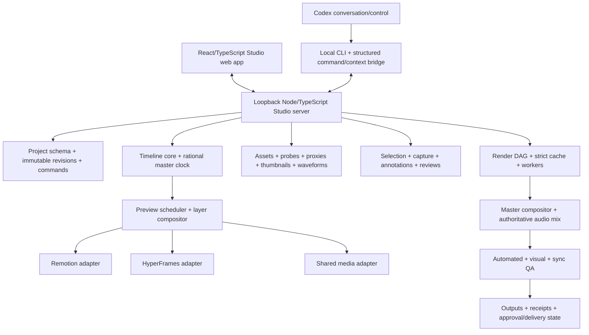

# Chai Studio — Final Updated Implementation Plan

**Plan version:** 2.0 — final merged execution baseline  
**Last updated:** 2026-07-14  
**Plan type:** Dependency-ordered, task-level implementation backlog  
**Coverage:** Complete Foundation + Professional Expansion product scope  
**Execution units:** 379 implementation tasks across 29 gated phases  
**Product source of truth:** `CHAI_STUDIO_MASTER_PLAN.md` (planning baseline 1.1)  
**Supersedes:** The earlier 29-phase implementation draft and the uploaded 22-phase supplemental plan  
**Generated UI references:** Five implementation-oriented PNG samples and an HTML index in `ui-samples/`  
**Status note:** This is the final execution plan, not a claim that the product is already implemented.

> This plan preserves the master plan's complete Foundation plus Professional Expansion target. It does **not** redefine “finished product” as a Premiere/Resolve replacement, cloud collaboration service, mobile editor, public plugin marketplace, hosted renderer, multicam system, or full nodal compositor. Those remain outside the current Version 1 target unless an approved scope revision promotes them.

## 0. Final merge decision and corrections

This document is the single execution companion to the master plan. It keeps the stronger 29-phase ownership and acceptance structure while importing the supplemental plan's runtime topology, explicit API/CLI inventory, deterministic fixture matrix, operational readiness work, and separate Foundation/Professional/Version 1 completion gates.

The following corrections are now binding:

1. **No hidden future-policy dependencies.** Audio transport, command authorization, QA/delivery lifecycle, caption rendering, isolation, privacy/redaction, preflight, receipt evidence, and source-monitor scope are frozen as exact Milestone 0 tasks before downstream implementation.
2. **No dependency cycles.** Every task dependency resolves to a concrete task ID; the generated graph must have zero missing references, zero ambiguous placeholders, and zero cycles.
3. **Security is three-stage.** Milestone 0 freezes the trust/isolation contract; feature phases implement against it; P23 performs enforcement hardening and adversarial verification before release.
4. **QA lifecycle has one authority.** `rendered_unchecked → qa_failed | qa_warning | qa_passed → approved → delivered` is defined once and enforced by QA, API, CLI, UI, and receipts.
5. **Caption rendering is producer/consumer based.** The caption subsystem produces deterministic compositor/subtitle artifacts; the render compositor and encoder consume them. Caption work never depends on the final encoder.
6. **Audio transport is contract-first.** The scheduler owns time; the shared audio graph follows it. Preview integration does not create a circular dependency between preview and audio.
7. **Source monitor scope is split correctly.** Foundation includes source inspection and independent scrubbing; source in/out, target-track patching, insert/overwrite/replace, and three-point editing belong to Professional Expansion.
8. **Release remains independently accepted.** Release engineering does not self-certify completion; P28 reruns clean-machine, recovery, security, fidelity, sync, reproducibility, and full-product acceptance.

## 1. Execution rules

1. A phase may begin only when its hard dependencies are accepted or when the task explicitly states that parallel work is safe.
2. “Accepted” requires linked implementation, automated tests, review evidence, and the phase-specific definition of done; a checklist count alone is not product completion.
3. All authoritative project changes use validated commands and coordinated immutable revisions. Direct JSON edits are never the normal mutation path.
4. Integer master frames and normalized rational rates are authoritative. Floating-point seconds are display/adapter values only.
5. Remotion and HyperFrames remain native behind adapters. The Chai Studio timeline, revision model, audio graph, bridge, render graph, QA, and receipts remain product-owned.
6. Codex remains the only conversation surface. Chai Studio exposes visual context and commands but contains no second chat panel.
7. Interactive preview is allowed to be approximate only when clearly labeled. Fidelity capture and final render use the declared final-compositor contract.
8. One shared audio graph owns the final program mix.
9. Caches, indexes, and job databases are regenerable. Human-readable project artifacts remain authoritative.
10. Imported executable compositions remain disabled until the approved isolation profile passes its security gate.
11. Encoding success is not delivery. QA and explicit approval remain separate required states.
12. No desktop wrapper or cloud account may become a Foundation dependency.

## 2. Recommended workstreams and ownership

| Workstream | Primary responsibility | Principal packages/surfaces |
|---|---|---|
| Product & UX | Requirements, workflows, UI specification, acceptance traceability | `docs/`, UI samples, product reviews |
| Project & Timeline | Schemas, revisions, commands, migrations, timing, edit semantics | `project-schema`, `timeline-core` |
| Server & Media | Local API, workers, files, asset registry, proxies, fonts | `studio-server`, `media-core` |
| Preview & Engines | Master scheduler, compositor, Remotion/HyperFrames/shared adapters | `preview-core`, engine packages |
| Editor UI | Shell, monitor, timeline, inspector, source, animation, delivery views | `studio-web`, `ui-components` |
| Audio & Language | Audio graph/mix, transcripts, captions | `audio-core`, transcript/caption modules |
| Codex & Review | Selection manifests, captures, annotations, CLI, source-edit bridge, versions | `codex-bridge`, review modules |
| Render & QA | DAG, cache, bridges, finishing, queue, profiles, receipts, QA | `render-core`, `qa-core` |
| Security & Release | Isolation, trust policy, licensing, diagnostics, packaging, upgrades | server workers, release scripts, docs |

## 3. Target architecture



## 4. Critical path and safe parallelism

**Critical path:** P00–P02 → P03–P05 → P07–P09 → P10/P11/P12 → P13/P14/P15 → P18 → P20 → P22 → P25 → P28.

**Safe parallel work after P02:**

- P03 repository bootstrap, P04 schema/revision implementation, and P01 specification refinement can progress with controlled contract reviews.
- P06 media pipeline and P08 UI shell can progress after their schemas/API mocks stabilize.
- P10 and P11 adapters can be implemented in parallel against P09’s conformance harness.
- P16 audio, P17 transcripts/captions, P18 bridge, and P23 security can progress in parallel once their foundation contracts exist.
- P21 queue UI and P22 QA UI can integrate against stable mocks before full render execution is complete.

## 5. Final phase map

| Phase | Work package | Exit result |
|---|---|---|
| P00 | Governance and scope lock | Approved scope, requirements, traceability, risks, ownership, and release semantics |
| P01 | UX architecture and UI specification | Five reviewed UI references, interaction rules, accessibility model, and control-to-contract map |
| P02 | Milestone 0 spikes and cross-cutting contract freeze | Measured proof plus frozen timing, capture, compositor, audio, authorization, QA, isolation, preflight, receipt, and source-monitor contracts |
| P03 | Monorepo and CI | Reproducible strict workspace, tooling, fixtures, launcher, and protected CI |
| P04 | Project authority | Human-readable schemas, coordinated immutable revisions, commands, migrations, autosave, and recovery |
| P05 | Timeline core | Exact rational timing, edit commands, selection, keyframes, indexes, undo/redo, and fuzz coverage |
| P06 | Media system | Import, hashing, VFR mapping, proxies, thumbnails, waveforms, fonts, relink, search, and rights |
| P07 | Local server and workers | Loopback API, events, authorization, typed workers, lifecycle, and rebuildable indexes |
| P08 | Studio web shell | React state architecture, workspaces, panels, shortcuts, accessibility, and shared UI components |
| P09 | Unified preview core | One master scheduler, mixed layers, interactive/fidelity modes, exact frame requests, and drift diagnostics |
| P10 | Remotion adapter | Native discovery, preview, exact render, dependencies, diagnostics, and upgrade fixtures |
| P11 | HyperFrames adapter | Isolated native preview/render, variables/adapters, policy reporting, dependencies, and upgrade fixtures |
| P12 | Shared adapter and capability registry | Shared media/captions/transforms plus explicit native/unified/bake/fallback/unsupported planning |
| P13 | Program and source-inspection monitors | Truthful program monitor, Foundation source inspection, transport, guides, capture, and diagnostics |
| P14 | Core timeline UI | Virtualized multitrack editing, visuals, keyboard operation, command parity, and performance |
| P15 | Inspectors and basic animation | Common/native/multi-selection controls, on-canvas transforms, keyframes, curves, transitions, and bridge inspection |
| P16 | Authoritative audio | One graph for preview/final mix, exact sample mapping, buses, automation, measurement, and sync |
| P17 | Transcripts and captions | Import/edit/navigation, deterministic caption artifacts, styling, validation, export, and tests |
| P18 | Codex context bridge | Revision-bound selection/context, exact captures, annotations, CLI, authorization, source edits, and stale-context protection |
| P19 | Local review workflow | Review bundles, issues, A/B comparison, version stacks, exceptions, and approval surfaces |
| P20 | Render DAG and cache | Deterministic dependency graph, strict cache, native/shared/bridge renders, compositor, audio, encoding, and receipts |
| P21 | Deliver workspace | Profiles, queue, progress, diagnostics, outputs, receipt viewer, and lifecycle controls |
| P22 | QA engine | Preflight, structural/visual/audio/sync QA, parity, exceptions, authoritative lifecycle, and delivery blocking |
| P23 | Security and compliance | Loopback/path/network/environment controls, trusted/untrusted separation, resource limits, redaction, and license review |
| P24 | Reliability and recovery | Repair, resume, cleanup, diagnostics, support bundles, fault injection, backup, and restore |
| P25 | Professional editing expansion | Roll/slip/slide, professional source editing, nested clips, speed/time remap, advanced curves, bridges, effects, and audio |
| P26 | Performance and accessibility completion | Benchmarks, optimization, honest degradation, shortcuts, accessibility, soak, and frozen budgets |
| P27 | Release engineering and operations | Reproducible packaging, install/uninstall, docs, upgrades, examples, backup/restore, clean-machine qualification, and support operations |
| P28 | Independent final acceptance | Complete Foundation + Professional Expansion proof, release evidence, signed receipt, rollback, and operational handoff |

## 6. Canonical repository layout

```text
chai-studio/
├── apps/
│   ├── studio-web/
│   └── studio-server/
├── packages/
│   ├── project-schema/
│   ├── timeline-core/
│   ├── preview-core/
│   ├── engine-remotion/
│   ├── engine-hyperframes/
│   ├── media-core/
│   ├── audio-core/
│   ├── render-core/
│   ├── codex-bridge/
│   ├── qa-core/
│   └── ui-components/
├── fixtures/
├── examples/
├── docs/
├── scripts/
└── pnpm-workspace.yaml
```

## 7. Implementation backlog

### P00 — Program governance and scope lock

**Objective:** Turn the master plan into one controlled execution program and prevent scope, architecture, and acceptance criteria from drifting.  
**Entry condition:** Approved master planning baseline.  
**Exit gate:** Scope, ownership, decision records, issue workflow, and acceptance traceability are approved; no implementation task can bypass a locked product rule.

| ID | Task | Dependencies | Definition of done |
|---|---|---|---|
| **P00.01** | Confirm the execution baseline and record the exact master-plan revision used by the team. | — | A signed baseline record links product scope, locked decisions, and every later implementation artifact. |
| **P00.02** | Define “finished product” as Foundation plus Professional Expansion; record excluded candidates such as cloud collaboration, multicam, public marketplace, nodal compositing, mobile editing, and hosted rendering. | P00.01 | Scope matrix has explicit in/out/deferred rows and an approval owner. |
| **P00.03** | Create the product requirements document with user stories, failure stories, and measurable acceptance criteria. | P00.01 | Every in-scope feature has at least one normal-flow and one failure-flow acceptance case. |
| **P00.04** | Create the architecture decision record index and copy all locked decisions into non-editable baseline ADRs. | P00.01 | ADR index covers conversation surface, local-first model, timeline authority, rational timing, audio authority, revisions, trust policy, and wrapper policy. |
| **P00.05** | Create a requirements-to-test traceability matrix. | P00.02,P00.03 | Every requirement maps to a phase, owner, test class, and release gate. |
| **P00.06** | Define workstreams, code owners, review owners, and escalation rules for product/UI, timeline, server/media, preview/adapters, bridge, render/QA, security, and release. | P00.03 | Repository ownership and required-review rules are documented. |
| **P00.07** | Define issue states and evidence requirements: Planned, Ready, In Progress, Blocked, Review, Accepted, Rejected. | P00.03 | No task can be marked Accepted without linked code, tests, and acceptance evidence. |
| **P00.08** | Open and maintain a risk register for timing drift, preview mismatch, cross-engine bridges, cache correctness, audio drift, upstream churn, licensing, and isolation. | P00.04 | Each risk has an owner, detection signal, mitigation, and blocking threshold. |
| **P00.09** | Define change-control rules for revising locked decisions or promoting deferred features. | P00.04 | Any change requires an ADR, impact analysis, migration/test plan, and explicit approval. |
| **P00.10** | Create a release-signoff checklist that separates encoded, QA-passed, approved, and delivered states. | P00.05 | Release workflow cannot treat successful encoding as delivery. |

### P01 — UX architecture, visual system, and interaction specification

**Objective:** Design an implementation-ready editor experience in which the monitor and timeline dominate, Codex remains the only chat surface, and preview/final truth is never ambiguous.  
**Entry condition:** P00 complete.  
**Exit gate:** The five principal workspaces, design tokens, component states, keyboard model, accessibility behavior, and prototypes are reviewed against product rules.

| ID | Task | Dependencies | Definition of done |
|---|---|---|---|
| **P01.01** | Map the primary end-to-end user journeys: create/open, import, edit, inspect/capture, request Codex changes, compare, render, QA, approve, and recover. | P00.03 | Each journey has happy path, loading, empty, warning, error, and recovery states. |
| **P01.02** | Define information architecture for Edit, Inspect, Media, Animation, and Deliver workspaces. | P01.01 | Workspace map identifies persistent global state and workspace-specific panels. |
| **P01.03** | Freeze the desktop shell: top status bar, collapsible media/project browser, program/source monitor, inspector, multitrack timeline, and status footer. | P01.02 | Layout supports resizable panels and preserves monitor/timeline priority. |
| **P01.04** | Create design tokens for surfaces, borders, spacing, typography, icon sizing, focus rings, selected states, warnings, errors, success, and engine indicators. | P01.03 | Tokens are machine-readable and cover light-independent initial dark theme. |
| **P01.05** | Specify component states for buttons, fields, sliders, tabs, tree rows, list/grid assets, clips, track headers, badges, progress, toasts, dialogs, and contextual menus. | P01.04 | Every component documents default, hover, focus, active, disabled, busy, warning, and error states where applicable. |
| **P01.06** | Define timeline interaction rules for selection, multi-selection, drag thresholds, trim handles, snapping, ripple mode, modifier keys, auto-scroll, and collision feedback. | P01.03 | Rules are unambiguous enough to implement without inventing behavior in code review. |
| **P01.07** | Define monitor behavior for fit/fill, zoom, pan, safe zones, guides, checkerboard, fullscreen, selected-layer highlight, A/B comparison, and capture menus. | P01.03 | Monitor spec distinguishes interactive preview, rendered fidelity, isolated capture, and comparison states. |
| **P01.08** | Define inspector progressive disclosure for common, Remotion-native, HyperFrames-native, bridge, multi-selection, asset, audio, and caption contexts. | P01.02 | Unsafe mixed edits and native-animation limitations are explicitly represented. |
| **P01.09** | Define keyboard command routing, focus ownership, text-entry exceptions, configurable shortcut model, and conflict handling. | P01.05 | Shortcut table covers transport, edit tools, marks, capture, markers, undo/redo, zoom, and navigation. |
| **P01.10** | Define accessibility requirements for keyboard operation, screen-reader labels, high contrast, reduced motion, scalable text, non-color-only status, and focus restoration. | P01.05 | Accessibility acceptance checks exist for every major workspace. |
| **P01.11** | Create high-fidelity samples for Edit, Inspect/Codex Bridge, Deliver/QA, Media/Source, and Animation/Bridge workspaces. | P01.03-P01.10 | Five reviewed samples exist in HTML and PNG form with implementation notes. |
| **P01.12** | Create a UI specification that maps every visible control to a command, query, or event contract. | P01.06-P01.11 | No production control is decorative or backed by an undefined operation. |

### P02 — Milestone 0 technical spikes and contract freeze

**Objective:** Retire the architecture risks that could invalidate the editor before building rich UI or broad feature depth.  
**Entry condition:** P00-P01 complete; spike dependencies may be installed only in an isolated branch/worktree.  
**Exit gate:** One deterministic mixed-engine fixture proves master seek, exact capture, final finishing, audio, revision recovery, environment identity, and untrusted-code containment; all cross-cutting contracts are frozen and the dependency graph is acyclic.

| ID | Task | Dependencies | Definition of done |
|---|---|---|---|
| **P02.01** | Select and pin the spike versions of Node.js, package manager, browser/runtime, FFmpeg build strategy, Remotion family, and HyperFrames family. | P00.08 | Lockfile and environment manifest reproduce the spike on the supported machine. |
| **P02.02** | Create the canonical mixed-engine fixture with one Remotion composition, one HyperFrames composition, raw video, image, captions, voiceover, music, alpha content, and a 30000/1001 timeline. | P02.01 | Fixture includes known frame anchors, audio cues, bridge boundaries, and expected hashes/metrics. |
| **P02.03** | Prototype the rational-rate integer-frame master clock with half-open ranges and explicit rounding boundaries. | P02.02 | Repeated frame mapping produces identical source-frame and audio-sample results. |
| **P02.04** | Prototype synchronized play, pause, seek, frame-step, loop, drift reporting, and hard resynchronization across both engines. | P02.03 | Measured drift meets the recorded spike budget or produces an explicit architecture revision. |
| **P02.05** | Prototype exact native still capture from Remotion and HyperFrames. | P02.02 | Both engines render the selected authoritative master frame repeatedly with deterministic identity under the strict environment. |
| **P02.06** | Prototype mixed-layer interactive preview with shared media and visible approximation warnings. | P02.04 | The program monitor can present layered engine and shared-media output without independent uncontrolled clocks. |
| **P02.07** | Test transparent intermediate formats and image-sequence fallback on target hardware. | P02.05 | Alpha mode, bit depth, decode path, quality, speed, and disk cost are measured and one default plus fallback is selected. |
| **P02.08** | Spike Remotion as the initial replaceable finishing compositor for mixed-engine delivery. | P02.05-P02.07 | A mixed-engine range reaches final encode through the proposed render-core boundary. |
| **P02.09** | Spike shared Web Audio preview and deterministic offline/FFmpeg audio mix from one authoritative graph. | P02.02 | Long-fixture sample boundaries and drift are measured; preview/final parameter mapping is documented. |
| **P02.10** | Prototype atomic coordinated revision commits, optimistic concurrency, stale-lock handling, crash before pointer swap, and orphan recovery. | P02.01 | Crash tests always leave the prior committed revision authoritative. |
| **P02.11** | Prototype source-edit begin/commit/abort and quarantine of unwrapped external source changes. | P02.10 | Native source patches become one reversible project transaction or remain non-authoritative. |
| **P02.12** | Prototype trusted and imported-untrusted composition isolation with filesystem, network, environment, CPU, memory, process, wall-time, and output limits. | P02.01 | Imported executable content cannot access denied resources and policy violations are observable. |
| **P02.13** | Define strict and compatible preview environment fingerprints and collect the first real fingerprints. | P02.05,P02.08 | Fingerprint input list and reuse rules are frozen for final vs non-final artifacts. |
| **P02.14** | Benchmark cold start, project open, warm seek, frame-step, native still, memory, GPU use, preview drift, audio drift, and render throughput. | P02.03-P02.09 | Evidence-backed budgets replace provisional assumptions. |
| **P02.15** | Consolidate spike results into candidate ADRs for adapter v1, schema v1, timing, compositor, isolation, environment identity, and measured performance/fidelity budgets. | P02.03-P02.14 | Candidate decisions include evidence, rejected alternatives, limitations, and unresolved blockers ready for cross-cutting contract freeze. |
| **P02.16** | Freeze the authoritative audio-transport contract: scheduler-owned time, audio start/seek barriers, scrub and J/K/L behavior, playback-rate policy, drift measurement/correction, latency reporting, and native-engine audio suppression. | P02.04,P02.09,P02.15 | Preview and audio packages can integrate without circular ownership; one documented policy governs interactive transport and final sample mapping. |
| **P02.17** | Freeze the command-authorization contract for UI, API, CLI, and Codex: read-only capabilities, normal mutations, destructive operations, idempotency/replay, actor/session identity, rate categories, and audit fields. | P02.10-P02.12,P02.15 | Every command class has one authorization level and no later phase needs an informal “security policy” dependency. |
| **P02.18** | Freeze the QA/approval/delivery lifecycle contract: `rendered_unchecked`, `qa_failed`, `qa_warning`, `qa_passed`, `approved`, and `delivered`, including invalidation, exceptions, actors, timestamps, and required evidence. | P00.10,P02.10,P02.15 | UI, API, render, QA, approvals, and receipts share one transition table; encoding alone can never produce `delivered`. |
| **P02.19** | Freeze the caption-render interface: deterministic caption layer plan, font/glyph dependencies, timing/highlight evaluation, burn-in compositor input, subtitle-file output, and QA anchors. | P02.05,P02.08,P02.15 | Caption production is independent of the final encoder and exposes stable artifacts for preview, compositor, delivery, and QA. |
| **P02.20** | Freeze the executable-content trust and worker-isolation interface: trust classes, approved roots, network/environment policy, read-only mounts, process/resource limits, cache separation, policy identity, and violation reports. | P02.12,P02.15 | Adapters and render workers can implement against a stable policy while P23 later hardens and adversarially verifies enforcement. |
| **P02.21** | Freeze the privacy, redaction, diagnostics-retention, and support-bundle contract, including project-relative paths, secret patterns, preview-before-export, and zero unsolicited telemetry. | P02.12-P02.13,P02.15 | Bridge, logs, receipts, and support bundles use one redaction policy without a diagnostics/privacy dependency cycle. |
| **P02.22** | Freeze the shared preflight rule-engine contract for schema, assets, fonts, capabilities, proxies, alpha, audio, rights, trust policy, disk, output paths, and environment compatibility. | P02.08-P02.09,P02.12,P02.15 | Render planning, Deliver UI, and QA can consume the same rule/result model while rule implementations mature incrementally. |
| **P02.23** | Freeze the source-monitor scope boundary: Foundation source inspection versus Professional source editing, including the master-clock isolation and command ownership rules. | P01.07-P01.08,P02.15 | Foundation contains viewing, independent scrub/frame-step, metadata, and safe prop/variable audition; source marks and edit insertion are reserved for P25. |
| **P02.24** | Freeze the render-receipt and evidence contract covering revision, job, profile, engines/adapters, strict environment, dependency hashes, cache lineage, outputs, audio measurements, QA, exceptions, approval, and reproduction inputs. | P02.08-P02.09,P02.13,P02.18 | Render, Deliver, QA, and release phases share one receipt contract and do not depend on a future informal “receipt policy.” |
| **P02.25** | Publish the cross-cutting contract index, exact task-dependency graph, and Milestone 0 cycle audit; approve or block production implementation. | P02.16-P02.24 | All downstream contracts have versioned owners and schemas; dependency validation reports zero missing IDs, ambiguous placeholders, and cycles. |


### P03 — Monorepo, developer platform, and CI bootstrap

**Objective:** Create a strict, reproducible workspace with enforceable package boundaries and fast local development.  
**Entry condition:** P02 gate passed.  
**Exit gate:** A clean checkout can install, type-check, lint, test, build, launch the local shell, and run deterministic fixtures using pinned tools.

| ID | Task | Dependencies | Definition of done |
|---|---|---|---|
| **P03.01** | Create the workspace with apps/studio-web, apps/studio-server, and packages for schema, timeline, preview, engine adapters, media, audio, render, bridge, QA, and UI components. | P02.25 | Repository structure matches ownership boundaries and avoids circular dependencies. |
| **P03.02** | Configure strict TypeScript, shared compiler presets, project references, path aliases, and package exports. | P03.01 | All packages compile with strict checks and no implicit cross-package private imports. |
| **P03.03** | Configure formatting, linting, import rules, unused-code checks, and commit-time validation. | P03.02 | Local and CI enforcement produce identical results. |
| **P03.04** | Select and configure unit, property, integration, visual, and end-to-end test runners. | P03.02 | One example test of each class runs in CI. |
| **P03.05** | Create deterministic fixture and golden-artifact directories with checksum manifests. | P03.04 | Fixture changes require explicit golden update review. |
| **P03.06** | Create shared error/result types, correlation IDs, structured logging, redaction helpers, and diagnostic categories. | P03.02 | Errors cross package/process boundaries without losing cause, stage, entity, or repair hint. |
| **P03.07** | Create workspace scripts for dev, build, typecheck, lint, test, fixture render, QA, clean-cache, and release validation. | P03.01-P03.06 | Commands work from repository root and fail with actionable messages. |
| **P03.08** | Configure CI with dependency caching, lockfile validation, unit/integration jobs, security checks, artifact retention, and protected release gates. | P03.03-P03.07 | Merges cannot bypass required checks or mutate golden artifacts silently. |
| **P03.09** | Add generated-code and schema-build rules so source schemas and generated validators cannot drift. | P03.02 | CI detects stale generated outputs. |
| **P03.10** | Create contributor, architecture, debugging, fixture, and test-evidence templates. | P03.01-P03.09 | New implementation work starts from consistent documentation and evidence conventions. |

### P04 — Authoritative project model, revisions, commands, and migrations

**Objective:** Implement the human-readable, crash-safe, reversible source of truth for every project mutation.  
**Entry condition:** P03 complete; P02 schema/timing contracts frozen.  
**Exit gate:** Projects can be created, mutated by validated commands, saved as coordinated immutable revisions, closed, reopened, migrated, undone, and recovered without state drift.

| ID | Task | Dependencies | Definition of done |
|---|---|---|---|
| **P04.01** | Implement normalized rational serialization and validation, including positive denominators, reduction to lowest terms, and safe bigint encoding. | P02.25,P03.02 | Round-trip tests cover NTSC rates, speed ratios, and invalid values. |
| **P04.02** | Implement schemas for chai.project, timeline, assets, settings, transaction, current-revision pointer, autosave metadata, named versions, and approval state. | P04.01 | Runtime and JSON-schema validation agree on valid and invalid fixtures. |
| **P04.03** | Implement semantic whole-project validation beyond structural schema checks. | P04.02 | Invalid references, timing, overlaps, source ranges, capabilities, audio graph, and approval transitions fail with entity-specific diagnostics. |
| **P04.04** | Implement the self-contained project-folder initializer and canonical directory structure. | P04.02 | A new project contains no authoritative database-only state and is valid immediately. |
| **P04.05** | Implement immutable revision directories and atomically replaced current-revision pointer. | P04.03-P04.04 | Crash injection before/after each write never exposes a partially coordinated revision. |
| **P04.06** | Implement project mutation lock acquisition, ownership, heartbeat, timeout, and stale-lock recovery. | P04.05 | Concurrent writers cannot silently overwrite each other. |
| **P04.07** | Implement baseRevisionId optimistic concurrency and structured conflict reports. | P04.05-P04.06 | Stale commands fail without silent rebasing and identify changed entities. |
| **P04.08** | Implement the generic validated command envelope with command ID, actor, timestamp, affected entities, payload schema, and expected revision. | P04.03 | All normal authoritative mutations pass through one audited interface. |
| **P04.09** | Implement transaction records with parent revision, before/after hashes, command summary, diff summary, source-edit metadata, and warnings. | P04.08 | Every committed revision can explain how and why it was created. |
| **P04.10** | Implement source-edit begin, commit, abort, validation, hash snapshot, diff capture, cache invalidation hooks, and external-change quarantine. | P04.08-P04.09 | Native source changes are reversible and cannot become authoritative outside the protocol. |
| **P04.11** | Implement command inversion and persistent multi-step undo/redo with asynchronous-operation barriers. | P04.08-P04.09 | Undo restores visible and persisted state; render history remains separate. |
| **P04.12** | Implement debounced autosave, pre-risk snapshots, rotating retention, crash detection, and recovery selection. | P04.05-P04.11 | A forced crash recovers the newest valid autosave without overwriting the last approved version. |
| **P04.13** | Implement named immutable versions: Draft, Review, Approved, Delivery Candidate, and Delivered. | P04.05,P04.09 | State transitions obey QA/approval rules and point to immutable revisions. |
| **P04.14** | Implement versioned migration registry, backups, dry-run reports, rollback where practical, and unsupported-version errors. | P04.02-P04.05 | Old fixtures migrate deterministically or fail clearly without silent timing reinterpretation. |
| **P04.15** | Build revision, concurrency, crash, undo, autosave, external-change, and migration test suites. | P04.01-P04.14 | The milestone foundation gate passes repeated close/reopen comparisons with no state drift. |

### P05 — Timeline core and edit-command semantics

**Objective:** Build a framework-independent, deterministic timeline model used identically by UI, bridge, preview, render, undo, and QA.  
**Entry condition:** P04 command/revision foundation complete.  
**Exit gate:** Core edits and timing transforms are deterministic, reversible, persist correctly, and pass property/fuzz tests.

| ID | Task | Dependencies | Definition of done |
|---|---|---|---|
| **P05.01** | Define stable entity IDs and immutable snapshot types for timelines, tracks, clips, nested sequences, keyframes, markers, transitions, bridges, captions, and automation. | P04.02 | No authoritative relation depends on array position or display name. |
| **P05.02** | Implement integer master-frame and half-open range primitives with overflow, bounds, and duration validation. | P04.01 | All APIs reject floating-point authority and invalid ranges. |
| **P05.03** | Implement exact timeline-to-source and source-to-timeline rational transforms, floor/ceiling policies, nested rates, speed ratios, and drop-frame display separation. | P05.02 | Golden math tests cover 23.976, 29.97, 59.94, nested sequences, and non-unit speed. |
| **P05.04** | Implement track ordering, visual z-order, audio bus order, lock/hide/mute/solo state, and track-type constraints. | P05.01 | Derived order is deterministic and validated. |
| **P05.05** | Implement clip placement, overlap rules, source in/out validation, handles, link groups, selection groups, and nested-sequence boundaries. | P05.01-P05.04 | Invalid placements return repairable conflict details. |
| **P05.06** | Implement snapping candidates for playhead, markers, clip boundaries, captions, phrases, keyframes, and user-defined guides. | P05.02-P05.05 | Snapping is frame-exact, priority-ordered, and toggleable. |
| **P05.07** | Implement select, multi-select, move, nudge, insert, overwrite, replace, duplicate, copy/paste, group/ungroup, and link/unlink commands. | P05.05-P05.06 | Each command has validation, inverse behavior, and stable selection outcome. |
| **P05.08** | Implement split/blade, trim in/out, ripple trim, ripple delete, lift, delete, and set/clear in-out range commands. | P05.05-P05.07 | Boundary, locked-track, linked-media, and nested-sequence cases pass tests. |
| **P05.09** | Implement track add/remove/rename/reorder plus clip rename and metadata-edit commands. | P05.04,P05.07 | No command bypasses revision/audit logic. |
| **P05.10** | Implement markers, issue categories, annotations references, approval markers, and navigation indexes. | P05.01,P05.08 | Markers remain stable through ripple and retiming according to documented policy. |
| **P05.11** | Implement common keyframe storage, interpolation metadata, property ownership, and native-animation preservation flags. | P05.01-P05.03 | Generic controls cannot silently overwrite engine-native animation authority. |
| **P05.12** | Implement derived indexes for visible clips, active layers, nearby context, asset usage, transcript phrases, render dependencies, and search. | P05.01-P05.11 | Indexes are rebuildable and never authoritative. |
| **P05.13** | Implement edit history labels and deterministic human-readable diff summaries. | P05.07-P05.11 | Undo menu and transaction log explain every edit in user terms. |
| **P05.14** | Create property-based and fuzz tests for ranges, ripple behavior, nested mappings, selection retention, command inversion, and serialization. | P05.02-P05.13 | Randomized sequences preserve invariants and round-trip state. |
| **P05.15** | Publish timeline-core API documentation and compatibility fixtures. | P05.01-P05.14 | UI, server, adapters, bridge, render, and QA consume one versioned contract. |

### P06 — Media, asset registry, proxies, fonts, and rights

**Objective:** Create a secure, hash-based media system that supports responsive editing without allowing proxy or missing-source mistakes in final delivery.  
**Entry condition:** P04-P05 foundations available.  
**Exit gate:** Assets import, analyze, proxy, relink, display, invalidate, and preflight reliably; deleting caches never loses creative state.

| ID | Task | Dependencies | Definition of done |
|---|---|---|---|
| **P06.01** | Implement asset registration with stable IDs, canonical/project-relative paths, file hashes, media family, rights metadata, and validation status. | P04.02 | Assets are authoritative in assets.json and survive cache deletion. |
| **P06.02** | Implement secure path normalization, traversal rejection, project-root policy, approved external asset references, and missing-path diagnostics. | P06.01 | No asset operation escapes approved roots. |
| **P06.03** | Integrate ffprobe/media inspection for container, codec, dimensions, rational FPS, duration, time base, sample rate, channels, alpha, and variable-frame-rate status. | P06.01 | Probe results are cached by content hash and validated. |
| **P06.04** | Implement duplicate detection by hash and source-change detection by path plus content identity. | P06.01-P06.03 | Duplicates and changed files are visible without silently substituting sources. |
| **P06.05** | Implement variable-frame-rate detection, constant-frame-rate proxy/mezzanine generation, and explicit source-to-proxy time maps. | P06.03 | Frame-accurate editing never trusts VFR timestamps directly. |
| **P06.06** | Implement configurable proxy profiles, background jobs, original/proxy switching, relink, invalidation, and final-source guard. | P06.03-P06.05 | Final render preflight rejects accidental proxy use. |
| **P06.07** | Implement thumbnail, contact-sheet, filmstrip, and waveform generation with content-addressed caching. | P06.03 | Generated views are cancelable, restartable, and invalidated by source/profile changes. |
| **P06.08** | Implement font registration, hash resolution, local bundle policy, missing-font diagnostics, and project font manifest. | P06.01 | Preview, fidelity capture, and final render resolve identical font files. |
| **P06.09** | Implement asset search/filter/sort by name, type, duration, resolution, rights, status, date, and usage count. | P06.01,P05.12 | Search indexes are rebuildable and support UI pagination/virtualization. |
| **P06.10** | Implement replace/relink flows, usage reports, reveal-in-filesystem action, approved/rejected/favorite states, and duplicate review. | P06.01-P06.09 | Relinking updates a reversible project transaction and invalidates dependent artifacts. |
| **P06.11** | Implement rights, source URL, creator, license, restrictions, attribution, proof, expiry, and review-date fields with delivery preflight hooks. | P06.01 | Unreviewed rights can warn or block according to profile policy. |
| **P06.12** | Build corrupt media, missing media, VFR, alpha, font, proxy, relink, duplicate, rights, and cache-deletion fixtures. | P06.01-P06.11 | Media milestone tests produce deterministic diagnostics and recovery behavior. |

### P07 — Local Studio server, API, event bus, and workers

**Objective:** Expose project, preview, bridge, media, render, and QA capabilities through a versioned loopback-only server with structured events and process isolation.  
**Entry condition:** P03-P06 core packages available.  
**Exit gate:** The server launches locally, enforces project scope, executes validated commands, supervises workers, streams state, and survives worker failures.

| ID | Task | Dependencies | Definition of done |
|---|---|---|---|
| **P07.01** | Implement loopback-only server bootstrap, port selection, single-instance/project-instance policy, local session token, origin checks, and startup health report. | P03.06,P06.02 | The server is not reachable from LAN by default and rejects unauthorized local origins. |
| **P07.02** | Define versioned API schemas and a common success/error envelope with correlation ID, stage, entity, retryability, and repair hints. | P03.06 | All HTTP/CLI/bridge operations share error semantics. |
| **P07.03** | Implement project endpoints for create, open, close, list recent, snapshot, revision history, named versions, migration report, and repair report. | P04.04-P04.14,P07.02 | Endpoints never mutate authoritative files outside the command layer. |
| **P07.04** | Implement command endpoint with baseRevisionId, lock handling, validation, commit, conflict response, undo, and redo. | P04.06-P04.11,P07.02 | A command either commits one coordinated revision or commits nothing. |
| **P07.05** | Implement asset endpoints for import, inspect, proxy, thumbnail, waveform, relink, replace, rights, search, and usage. | P06.01-P06.11,P07.02 | Long operations return jobs and stream progress. |
| **P07.06** | Implement preview/session endpoints for load, transport, seek, frame-step, quality, preload, state, and adapter diagnostics. | P02.25,P07.02 | Commands are serialized through the authoritative scheduler contract. |
| **P07.07** | Implement selection, context, capture, annotation, comparison, and source-edit transaction endpoints. | P04.10,P05.10,P07.02 | Read operations may be automatic; mutations require command authorization. |
| **P07.08** | Implement render, queue, cancellation, retry, outputs, QA, approval, and receipt endpoints as contract placeholders before render-core completion. | P07.02 | UI can integrate against stable mocked schemas while backend stages mature. |
| **P07.09** | Implement WebSocket or SSE event stream for revision, selection, transport, buffering, dropped frames, asset jobs, render progress, QA state, warnings, and worker health. | P07.02-P07.08 | Events are ordered per stream, resumable where required, and include correlation IDs. |
| **P07.10** | Implement worker process supervisor, typed RPC, heartbeats, crash restart, resource limits, cancellation, and log capture. | P03.06,P07.02 | A worker crash cannot corrupt project state or bring down the server. |
| **P07.11** | Use SQLite only for regenerable job/cache/search indexes and implement rebuild-on-delete behavior. | P04.02,P07.05,P07.08 | Deleting SQLite state loses no creative or approval data. |
| **P07.12** | Implement disk-space preflight, temp-root management, orphan cleanup, file watcher, external-change quarantine notification, and graceful shutdown. | P04.10,P06.04,P07.10 | Shutdown/cancel/restart leaves valid revisions and cache artifacts intact. |

### P08 — Studio web shell, state architecture, and shared UI components

**Objective:** Build the responsive desktop editor shell and state plumbing without embedding product logic in components.  
**Entry condition:** P01 specification accepted; P07 contracts available.  
**Exit gate:** All five workspaces load against mocked/real APIs, persist layout, handle errors, and expose keyboard-accessible production component primitives.

| ID | Task | Dependencies | Definition of done |
|---|---|---|---|
| **P08.01** | Bootstrap React, TypeScript, and Vite application with route/workspace boundaries and error isolation. | P03.01,P01.02 | A component failure cannot blank the entire editor without recovery action. |
| **P08.02** | Select and document client state separation for server snapshots, transient interaction state, transport state, command state, and cached queries. | P07.02 | Authoritative project state is never duplicated as an uncontrolled mutable client model. |
| **P08.03** | Implement API client, event subscription, reconnect/resync logic, correlation IDs, stale-revision detection, and typed mocks. | P07.02,P07.09 | UI recovers from server/stream restart without silently losing selection or edits. |
| **P08.04** | Implement design-token package and shared components specified in P01. | P01.04-P01.05 | Components pass visual, keyboard, focus, disabled, busy, warning, and error state checks. |
| **P08.05** | Implement top bar with project/revision identity, workspace switcher, authoritative timecode, preview mode, render status, capture, and render actions. | P08.03-P08.04 | Status labels derive from real state and never fake success. |
| **P08.06** | Implement resizable/collapsible panel system, minimum sizes, saved workspace layouts, reset layout, and monitor/timeline dominance rules. | P01.03,P08.04 | Layouts remain usable at the supported minimum desktop viewport. |
| **P08.07** | Implement global command/shortcut router with focus scopes, tool modes, text-input exclusions, conflict display, and later configurability. | P01.09,P08.04 | Keyboard actions match visible command state and are screen-reader discoverable. |
| **P08.08** | Implement toasts, inline validation, blocking dialogs, progress surfaces, repair actions, detailed-log drawers, and no-fake-success policy. | P07.02,P08.04 | Every server error category has a visible, actionable presentation. |
| **P08.09** | Implement empty/loading/offline/reconnecting/migrating/recovering/read-only/conflict states for each workspace. | P08.03-P08.08 | State gallery and visual tests cover all non-happy paths. |
| **P08.10** | Add UI performance instrumentation for render cost, long tasks, virtual-list load, event lag, and interaction latency. | P08.01-P08.09 | Development diagnostics identify slow components without sending telemetry externally. |

### P09 — Preview core, master scheduler, and layer compositor

**Objective:** Drive all preview surfaces from one authoritative frame clock while clearly separating interactive approximation from rendered truth.  
**Entry condition:** P02 contracts frozen; P05 timeline and P07 worker/API foundations available.  
**Exit gate:** Mixed-engine fixtures remain aligned through repeated transport operations, report degradation honestly, and render exact selected frames through the fidelity path.

| ID | Task | Dependencies | Definition of done |
|---|---|---|---|
| **P09.01** | Implement transport state machine for stopped, loading, paused, playing, seeking, buffering, error, and disposed states. | P02.25,P05.02 | Invalid transitions are rejected and every state is observable. |
| **P09.02** | Implement authoritative masterFrame, rational presentation timestamp, session ID, play rate, loop range, in/out range, and frame/second stepping. | P05.02-P05.03 | No attached adapter advances authoritative time independently. |
| **P09.03** | Implement seek barriers that halt adapters/audio, request the exact frame, await readiness, present atomically, and report partial failures. | P09.01-P09.02 | Repeated seek to one frame yields the same intended composite. |
| **P09.04** | Implement synchronized playback sessions, adapter frame reports, drift calculation, dropped-frame accounting, hard resync, and session cancellation. | P09.01-P09.03 | Long mixed-engine fixture stays within measured drift policy. |
| **P09.05** | Implement preload windows, buffering model, buffered-range aggregation, cache freshness state, and back-pressure. | P09.02-P09.04 | UI can distinguish waiting for media, engine, render fallback, and audio. |
| **P09.06** | Implement interactive quality policies for proxy/original, resolution scale, disabled expensive effects, fallback layers, and load-based degradation. | P06.06,P09.05 | Quality changes are explicit and never relabeled as fidelity. |
| **P09.07** | Implement preview layer graph with deterministic z-order, common transforms, opacity, crop, blend mode, letterbox/pillarbox, guides, and annotation overlays. | P05.04-P05.05,P09.02 | Remotion, HyperFrames, and shared layers composite in timeline order. |
| **P09.08** | Implement native-layer, shared-layer, and baked-fallback lifecycle with preload, present, suspend, error, and disposal boundaries. | P09.05-P09.07 | A failing layer yields a visible error/fallback without corrupting transport. |
| **P09.09** | Implement rendered-fidelity frame and short-range requests through the final-compositor contract. | P02.08,P09.03 | Fidelity results record frame, compositor, settings, environment, color, alpha, and dependency identity. |
| **P09.10** | Implement preview warnings for proxy, baked fallback, unsupported effect, missing asset/font, stale cache, buffering, dropped frames, and render-required difference. | P06.06,P09.05-P09.09 | Warning state reaches server events and UI with direct remedy actions. |
| **P09.11** | Implement color/alpha normalization contract for exact comparisons. | P02.07,P02.13,P09.09 | Strict environment deterministic fixtures compare by normalized pixel hash. |
| **P09.12** | Implement audio transport hooks, barriers, latency/drift reporting, scrub/rate policy, and native-engine audio suppression against the frozen audio-transport contract. | P02.16,P09.02-P09.04 | Preview scheduler exposes one authoritative session interface that the shared audio graph follows without circular ownership. |
| **P09.13** | Build repeated seek, play/pause/scrub, loop, quality-change, layer-failure, drift, fallback, and fidelity integration tests. | P09.01-P09.12 | Unified preview milestone gate passes the mixed-engine fixture. |
| **P09.14** | Publish preview-core and layer-adapter contracts with compatibility test harness. | P09.01-P09.13 | Engine adapters can be upgraded independently against one conformance suite. |

### P10 — Remotion engine adapter

**Objective:** Provide a pinned, testable Remotion integration for discovery, native preview, exact capture, range render, dependency inspection, and finishing.  
**Entry condition:** P09 contract harness available.  
**Exit gate:** Remotion fixtures pass adapter conformance, deterministic capture, dependency, failure, and upgrade tests.

| ID | Task | Dependencies | Definition of done |
|---|---|---|---|
| **P10.01** | Implement composition discovery, metadata extraction, dimensions/FPS/duration validation, and input-prop schema discovery. | P09.14 | Invalid or ambiguous compositions produce structured diagnostics. |
| **P10.02** | Implement source validation for component path, props, delayed rendering, fonts, assets, unsupported configuration, and version compatibility. | P10.01 | Validation runs without starting a final render. |
| **P10.03** | Implement Player host lifecycle, master-frame seek, readiness barrier, current-frame reporting, suspend, and disposal. | P09.03-P09.08 | Player never owns the project clock. |
| **P10.04** | Implement synchronized playback optimization under the preview session contract. | P09.04,P10.03 | Native playback is disabled or resynced when drift exceeds policy. |
| **P10.05** | Implement exact still rendering with declared frame, props, composition, browser, color, alpha, and environment identity. | P09.09-P09.11,P10.02 | Repeated strict-environment stills match normalized hashes. |
| **P10.06** | Implement range/video rendering, progress, cancellation, logs, and artifact metadata. | P10.02 | Canceled renders leave no falsely valid cache artifact. |
| **P10.07** | Implement dependency collection for source modules, props, media, fonts, runtime packages, approved network resources, and generated code. | P10.01-P10.02 | Dependency set is complete enough for selective cache invalidation. |
| **P10.08** | Implement browser console, delay, load, render, and asset error capture with source mapping. | P10.03-P10.06 | UI/receipt diagnostics identify composition and failing frame. |
| **P10.09** | Implement native inspector descriptor for props, calculated metadata, source path, warnings, and capability classifications. | P10.01-P10.02 | Inspector controls are generated only for validated safe props. |
| **P10.10** | Implement initial finishing-compositor composition generation behind render-core interface and add upgrade compatibility fixtures. | P02.08,P10.05-P10.07 | Mixed-engine finishing does not leak Remotion ownership into project schema. |

### P11 — HyperFrames engine adapter

**Objective:** Provide a pinned, isolated HyperFrames integration for metadata, seekable preview, exact capture, rendering, variables, frame adapters, and diagnostics.  
**Entry condition:** P09 contract harness and P02.20 isolation contract available; P23 enforcement hardening proceeds in parallel.  
**Exit gate:** HyperFrames fixtures pass adapter conformance, deterministic seek/capture, isolation, dependency, failure, and upgrade tests.

| ID | Task | Dependencies | Definition of done |
|---|---|---|---|
| **P11.01** | Implement HTML composition discovery, metadata inspection, declared dimensions/FPS/duration, variables, tracks, timing attributes, and active frame-adapter detection. | P09.14 | Missing or conflicting metadata is reported before preview. |
| **P11.02** | Implement lint/validate/inspect integration and map diagnostics to source files, elements, adapters, and frames. | P11.01 | Validation reports seekability, nondeterminism, expensive state, network use, and unsupported capabilities. |
| **P11.03** | Implement isolated preview host lifecycle, master seek forwarding, exact-frame readiness, state report, suspend, and disposal. | P09.03-P09.08 | HTML runtime cannot advance the project clock independently. |
| **P11.04** | Implement synchronized playback optimization under the preview session contract. | P09.04,P11.03 | Drift is measurable and triggers the same resync policy as other adapters. |
| **P11.05** | Implement exact still capture and range rendering with declared browser, adapter set, color, alpha, environment, and trust policy. | P09.09-P09.11,P11.02 | Strict fixture captures match normalized hashes or carry approved nondeterminism metrics. |
| **P11.06** | Implement dependency collection for HTML, CSS, media, fonts, scripts, adapters, packages, shaders, data, and approved network resources. | P11.01-P11.02 | Dependency changes invalidate only dependent artifacts. |
| **P11.07** | Implement native inspector descriptor for variables, tracks, frame adapters, timing, validation, warnings, source path, and capability classes. | P11.01-P11.02 | Unsafe variables and unsupported native state are read-only or warned. |
| **P11.08** | Implement reporting for non-seekable effects, expensive stateful simulations, unsupported APIs, navigation, popups, downloads, and policy violations. | P11.02-P11.05 | Imported-untrusted violations block output and appear in diagnostics/receipts. |
| **P11.09** | Implement trusted-authored versus imported-untrusted worker selection and cache separation. | P02.20,P11.03 | No artifact from a weaker policy is reused in a stronger trust context. |
| **P11.10** | Create upgrade and adapter-conformance fixtures for GSAP, Lottie, Three.js, Rive, WAAPI, D3, PixiJS, shaders, and custom frame adapters. | P11.01-P11.09 | Supported capability registry entries are backed by passing fixtures. |

### P12 — Shared media adapter and capability registry

**Objective:** Handle timeline-native media, captions, solids, common transforms, transitions, and explicit capability/fallback decisions consistently across engines.  
**Entry condition:** P05, P06, and P09 available.  
**Exit gate:** Shared clips preview/render deterministically and the capability registry drives inspector, warnings, render planning, fallbacks, and regression tests.

| ID | Task | Dependencies | Definition of done |
|---|---|---|---|
| **P12.01** | Implement capability registry schema and statuses: native, unified, bake_required, fallback_available, unsupported, and experimental. | P02.25 | Every capability entry names owner, preview behavior, render behavior, fallback, and test fixture. |
| **P12.02** | Populate initial capability families for typography, media, captions, audio, React, HTML/CSS, SVG, Canvas, Lottie, Rive, GSAP, WAAPI, Three.js/WebGL, shaders, particles, transitions, alpha, HDR/color depth, and distributed rendering. | P12.01,P10.09,P11.07 | Registry reflects evidence rather than assumptions. |
| **P12.03** | Implement shared image, video, and solid/color clip preview with rational source sampling, proxies, alpha, and common transforms. | P06.03-P06.06,P09.07 | Shared visuals obey the same frame and layer rules as engines. |
| **P12.04** | Implement shared caption/subtitle preview clip and timing hooks. | P05.01,P09.07 | Caption presentation is deterministic at frame boundaries. |
| **P12.05** | Implement shared common effects metadata for transform, opacity, crop, blend, and adjustment references. | P05.11,P09.07 | Unsupported effect combinations surface registry-driven warnings. |
| **P12.06** | Implement timeline-native hard cut, dissolve, dip, wipe, push/slide, zoom, and blur transition primitives where deterministic. | P05.01,P09.07 | Boundary frames contain no duplication or gaps. |
| **P12.07** | Implement proxy/baked fallback adapter and provenance labels. | P06.06,P09.08 | Fallback artifacts record source, cache key, environment class, and approximation limits. |
| **P12.08** | Implement source/media audio suppression rules so engine clip audio cannot double-mix the program. | P05.04,P09.12 | Native source-audio inspection is isolated from the master program graph. |
| **P12.09** | Implement registry-driven inspector descriptors, preview warnings, render planning decisions, and upgrade test selection. | P12.01-P12.08 | One registry change updates all consumers consistently. |
| **P12.10** | Build shared media, alpha, transform, transition, caption, proxy, capability, and fallback fixtures. | P12.03-P12.09 | Shared adapter passes the same conformance harness as native adapters. |

### P13 — Program monitor, Foundation source inspection, and transport UI

**Objective:** Implement truthful, frame-accurate visual inspection surfaces and transport controls over the preview core.  
**Entry condition:** P08 shell and P09-P12 preview/adapters available.  
**Exit gate:** Users can inspect the final composite or source, navigate by frame, understand fidelity state, and request exact captures without ambiguity.

| ID | Task | Dependencies | Definition of done |
|---|---|---|---|
| **P13.01** | Implement program monitor viewport with aspect-fit/fill, letterbox/pillarbox, checkerboard, zoom, pan, resize observation, and high-DPI scaling. | P08.04,P09.07 | Canvas coordinates map exactly to normalized composition space. |
| **P13.02** | Implement visible interactive/rendered-fidelity mode label, proxy/original indicator, native/baked status, buffering, dropped-frame, stale-cache, and render-required warnings. | P09.05-P09.10 | No approximate preview can appear unlabeled as final truth. |
| **P13.03** | Implement transport controls for play/pause, frame/second step, J/K/L shuttle, start/end, in/out, loop, rate, and authoritative timecode/frame display. | P08.07,P09.01-P09.04 | Buttons and shortcuts dispatch the same transport commands. |
| **P13.04** | Implement safe zones, grid, guides, center lines, custom guides, and selected-layer outline overlays. | P13.01 | Overlays never enter fidelity capture unless explicitly requested. |
| **P13.05** | Implement fullscreen monitor with focus/shortcut preservation and visible exit affordance. | P13.01-P13.03 | Fullscreen state does not change authoritative playback state. |
| **P13.06** | Implement compact capture button/menu for current frame, exact fidelity, isolated clip, before effects, alpha, A/B, range, and contact sheet. | P13.02-P13.03 | Advanced modes are discoverable without permanent toolbar clutter. |
| **P13.07** | Implement A/B and before/after comparison modes with split, wipe, onion, difference overlay, linked zoom/pan, and frame identity display. | P13.01,P09.09 | Both compared artifacts declare revision, frame, mode, and environment. |
| **P13.08** | Implement the Foundation source-inspection monitor for raw media, images, Remotion, and HyperFrames with independent scrub/frame-step, source-frame/time display, metadata, and safe prop/variable audition. | P02.23,P10.03,P11.03,P12.03 | Source inspection never owns or alters the master timeline clock and exposes no source-edit insertion commands. |
| **P13.09** | Implement source-inspection selection, compare-to-timeline navigation, add-to-context/capture actions, and preview-only prop/variable audition with explicit reset. | P02.23,P07.07,P13.08 | Source inspection can enrich Codex context and visual review without creating source in/out, target-track, insert, overwrite, or replace edits. |
| **P13.10** | Implement monitor context menus, status hints, keyboard help, and screen-reader names. | P01.09-P01.10,P13.01-P13.09 | All monitor operations are keyboard reachable. |
| **P13.11** | Build monitor visual regression and interaction tests for every mode, warning, overlay, and scaling condition. | P13.01-P13.10 | Golden images and interaction tests pass at supported viewport/DPI classes. |
| **P13.12** | Validate capture coordinate mapping from scaled monitor to normalized composition space. | P13.01,P13.04,P13.06 | Annotations remain aligned after resize, fullscreen, and different export resolutions. |

### P14 — Core multitrack timeline UI and editing

**Objective:** Provide a dense, virtualized, keyboard-capable professional timeline backed exclusively by timeline commands.  
**Entry condition:** P05 command semantics, P06 view artifacts, P08 shell, and P13 transport available.  
**Exit gate:** Every core edit is visible, reversible, persistent, keyboard accessible, and consistent under zoom, virtualization, snapping, and linked media.

| ID | Task | Dependencies | Definition of done |
|---|---|---|---|
| **P14.01** | Implement virtualized track rows, clip layers, horizontal viewport, vertical scroll, pinned ruler/track headers, and high-DPI rendering strategy. | P05.12,P08.10 | Hundreds of clips/tracks remain interactive without rendering offscreen nodes. |
| **P14.02** | Implement rational time ruler, frame ticks, timecode labels, marker lane, playhead, in/out range, loop range, and range selection. | P05.02-P05.03,P13.03 | Display may use timecode, but all hit-testing returns integer frames. |
| **P14.03** | Implement track headers with name/type, add/remove/reorder, lock, hide, mute, solo, height controls, and accessibility labels. | P05.04,P05.09 | Track state changes are reversible commands. |
| **P14.04** | Implement clip visuals for labels, engine indicator, thumbnails/filmstrips, waveform, caption text, keyframes, transitions, bridges, render/cache state, warnings, and source handles. | P06.07,P12.09 | Visual states are driven by authoritative/derived data, not local guesses. |
| **P14.05** | Implement single/multi/range selection, marquee, modifier behavior, focus model, persistent selection, and synchronized inspector/monitor/bridge manifest updates. | P05.01,P08.07 | Selection remains stable through safe edits and explicit after-state rules. |
| **P14.06** | Implement move/nudge drag with snapping, track constraints, linked groups, auto-scroll, ghost preview, conflict feedback, and command commit. | P05.06-P05.07 | Pointer cancellation commits nothing; successful drop creates one transaction. |
| **P14.07** | Implement insert, overwrite, replace, duplicate, copy/paste, group/ungroup, link/unlink, and target-track workflows. | P05.07 | Edit previews match command results before commit. |
| **P14.08** | Implement blade/split, trim in/out, ripple trim, ripple delete, lift, delete, and trim-handle keyboard adjustments. | P05.08 | Locked tracks, zero duration, source limits, and linked clips are handled predictably. |
| **P14.09** | Implement snap toggles and priority feedback for playhead, markers, clips, captions, transcript phrases, keyframes, and guides. | P05.06 | Active snap target is visible and exact. |
| **P14.10** | Implement add/remove/rename tracks/clips, fit timeline, fit selection, horizontal/vertical zoom, scroll-to-playhead, and navigator/minimap if evidence supports it. | P05.09,P14.01-P14.02 | Navigation works with mouse, keyboard, and large timelines. |
| **P14.11** | Implement jump to previous/next edit, marker, caption, phrase, warning, and search result. | P05.10,P05.12 | Navigation uses derived indexes and does not scan full state on every keypress. |
| **P14.12** | Implement timeline search by clip name, asset, source path, transcript, marker, rights, engine, warning, and cache status. | P05.12,P06.09 | Results reveal and select exact entities/frames. |
| **P14.13** | Implement undo/redo UI with history labels, conflict states, pending async barriers, and autosave status. | P04.11-P04.12,P05.13 | History UI accurately reflects committed revision state. |
| **P14.14** | Implement clip/track context menus and command palette using the same command registry as shortcuts. | P08.07,P14.05-P14.13 | No duplicate mutation logic exists in menus. |
| **P14.15** | Build interaction tests for drag, trim, ripple, snap, auto-scroll, zoom, virtualization, undo, keyboard, and concurrent revision conflicts. | P14.01-P14.14 | Core editing milestone gate passes on deterministic fixtures. |
| **P14.16** | Run accessibility and latency validation for timeline focus, screen-reader summaries, visible focus, and sub-frame interaction targets. | P01.10,P14.01-P14.15 | Supported operations are keyboard-complete and interaction latency meets baseline. |

### P15 — Inspector, common properties, native controls, and keyframes

**Objective:** Expose safe contextual editing while preserving native engine capabilities and clearly representing mixed values and bake requirements.  
**Entry condition:** P12 registry and P14 selection/editor available.  
**Exit gate:** Common/native/bridge/multi-selection inspectors issue validated commands and keyframe editing is deterministic.

| ID | Task | Dependencies | Definition of done |
|---|---|---|---|
| **P15.01** | Implement inspector context resolver for no selection, single clip, multi-clip, track, asset, marker, keyframe, transition, bridge, caption, and render output. | P14.05 | Context changes preserve focus/unsaved input safely. |
| **P15.02** | Implement common properties: name/ID, track/range, source in/out, position, scale, rotation, anchor, opacity, crop, blend, speed, volume, fades, and common keyframes. | P05.11,P15.01 | Each field declares unit, bounds, ownership, keyframeability, and capability support. |
| **P15.03** | Implement validated numeric/text/color/enum/file inputs with scrubbing, reset, mixed values, expression-free authority, and commit/cancel behavior. | P08.04,P15.02 | Partial edits never corrupt project state. |
| **P15.04** | Implement Remotion-native inspector from adapter descriptor with props, calculated metadata, source path, dependency summary, warnings, and open-source action. | P10.09,P15.01 | Only validated safe props are editable. |
| **P15.05** | Implement HyperFrames-native inspector with variables, tracks, adapters, timing, validation, warnings, source path, and open-source action. | P11.07,P15.01 | Unsafe or non-seekable state is clearly read-only/warned. |
| **P15.06** | Implement multi-selection inspector showing only safe shared properties and explicit mixed values. | P15.01-P15.03 | Bulk commands validate all targets atomically. |
| **P15.07** | Implement capability/bake/fallback badges and direct actions to render proxy, switch fallback, inspect source, or open bridge editor. | P12.09,P15.01 | Badges are contextual and do not over-brand ordinary clips. |
| **P15.08** | Implement keyframe toggle, previous/next keyframe, add/remove, copy/paste, align/distribute, retime, interpolation selection, and property lanes. | P05.11,P15.02 | Keyframe commands preserve exact integer frames and rational values where needed. |
| **P15.09** | Implement curve editor primitives for linear, hold, ease, ease-in/out, cubic-bezier handles, value graph, and speed graph where valid. | P15.08 | Curve serialization and evaluation are deterministic. |
| **P15.10** | Implement native-animation ownership warning and explicit conversion workflow to shared keyframes where supported. | P05.11,P10.09,P11.07 | The UI never implies all native animation is generically editable. |
| **P15.11** | Implement inspector validation summaries, dependency hashes, cache state, and affected-render estimate. | P12.09,P15.01 | Users can see why a change will invalidate artifacts. |
| **P15.12** | Build inspector/keyframe unit, interaction, mixed-selection, capability, and visual regression tests. | P15.01-P15.11 | Inspector changes are reversible and persist after reopen. |

### P16 — Authoritative audio graph, preview mix, and final mix

**Objective:** Provide one audio authority with low-latency preview and deterministic sample-accurate final output.  
**Entry condition:** P02 audio spike accepted; P05 timeline, P06 media, and P09 transport available.  
**Exit gate:** Long mixed-engine timelines maintain sync; preview/final settings derive from one graph; loudness/clipping/channel QA is reproducible.

| ID | Task | Dependencies | Definition of done |
|---|---|---|---|
| **P16.01** | Define audio graph schema for sources, clips, buses, gain, pan, fades, crossfades, automation, ducking, channel maps, sync anchors, and processing references. | P04.02,P05.01 | Audio graph is human-readable, versioned, and authoritative. |
| **P16.02** | Implement exact master-frame/rational-rate to audio-sample range mapping with floor start and ceiling exclusive end. | P05.03 | Unit tests cover long durations and non-integer frame/sample relationships. |
| **P16.03** | Implement media decode/cache abstraction for preview with original/proxy policy, resampling, channel conversion, and gap handling. | P06.03-P06.06 | Decode errors identify source and exact timeline range. |
| **P16.04** | Implement Web Audio preview graph, transport synchronization, start/seek barriers, latency compensation, scrubbing/J-K-L/rate policy, and dropped-buffer reporting. | P02.16,P09.02-P09.05,P16.01-P16.03 | Audio follows the master scheduler contract, never becomes clock authority, and never double-plays engine audio. |
| **P16.05** | Implement gain, mute/solo, pan, fades, equal-power crossfades, keyframed volume, and bus routing. | P16.01,P16.04 | Preview and offline evaluators use the same automation curves. |
| **P16.06** | Implement voiceover, music, SFX, and ambience buses with bus meters and master output. | P16.01,P16.05 | Solo/mute and routing produce deterministic graph evaluation. |
| **P16.07** | Implement ducking analysis/control as explicit automation generation with reversible commands. | P16.05-P16.06 | Ducking never hides irreversible signal processing. |
| **P16.08** | Implement optional normalization/noise-reduction preprocessing as separately generated, attributable assets. | P06.01,P16.03 | Original media remains preserved and processing is explicit. |
| **P16.09** | Implement deterministic offline mix renderer/FFmpeg graph, lossless intermediate, progress, cancellation, and artifact identity. | P16.01-P16.07 | The same graph and automation values feed preview and final mix. |
| **P16.10** | Implement loudness, true peak, clipping, silence, channel, sample-rate, and duration measurements. | P16.09 | Measurements are written to render receipts and QA. |
| **P16.11** | Implement waveform views, meters, automation UI hooks, fade handles, sync markers, and audio inspector descriptors. | P06.07,P14.04,P15.02,P16.05 | UI edits map to audio commands and exact graph state. |
| **P16.12** | Build long-timeline drift, sample-boundary, seek, pause/resume, crossfade, ducking, channel, silence, clipping, and cancel/retry tests. | P16.01-P16.11 | Audio non-negotiable acceptance tests pass. |

### P17 — Transcript and caption system

**Objective:** Connect timed language data to navigation, editing, captions, QA, and delivery without losing source synchronization.  
**Entry condition:** P05, P06, P14, and P16 available.  
**Exit gate:** Transcripts and captions import, edit, navigate, style, validate, render, and export with phrase/frame accuracy.

| ID | Task | Dependencies | Definition of done |
|---|---|---|---|
| **P17.01** | Define transcript schema for words, phrases, speakers, confidence, correction state, lock state, source audio, and exact time/frame mapping. | P04.02,P16.02 | Transcript round trips preserve timing and text authority. |
| **P17.02** | Implement SRT/VTT and internal transcript/caption import with validation, normalization, and error reports. | P17.01 | Malformed cues do not enter authoritative state silently. |
| **P17.03** | Implement transcript search, click-to-seek, phrase selection, current-phrase highlight, speaker filter, and confidence/correction display. | P05.12,P14.11 | Navigation lands on exact master-frame boundaries. |
| **P17.04** | Implement marker-from-phrase, split-at-phrase, range-select, caption-generation, and script-comparison commands. | P05.08,P05.10,P17.03 | Commands are reversible and maintain source linkage. |
| **P17.05** | Implement caption track clips, line/word timing, phrase-accurate trim, text edit, lock state, and styling-template references. | P05.01,P12.04 | Caption boundaries use integer frames with documented word highlight sampling. |
| **P17.06** | Implement caption inspector for typography, box, alignment, safe area, max lines, line length, reading speed, and highlighting. | P15.01,P17.05 | Invalid styles and timing display immediate validation. |
| **P17.07** | Implement safe-zone, collision, reading-speed, maximum-line-length, minimum-duration, and overlap checks. | P13.04,P17.05-P17.06 | Checks feed live warnings and pre/post-render QA. |
| **P17.08** | Implement deterministic caption layer-plan and subtitle-artifact generation for burn-in, separate delivery, word/line highlighting, and SRT/VTT export. | P02.19,P12.04,P17.05-P17.07 | Artifacts carry exact timing, style, font/glyph dependencies, hashes, and QA anchors; the final compositor/encoder consumes them without a reverse dependency. |
| **P17.09** | Implement transcript/source-monitor split view and timeline phrase navigation. | P13.08,P14.11,P17.03 | Selection remains synchronized across transcript, source, timeline, and monitor. |
| **P17.10** | Build import/export, phrase edit, split, caption layout, highlighting, collision, reading-speed, safe-zone, and delivery tests. | P17.01-P17.09 | Caption/transcript acceptance fixtures pass visual and timing regression. |

### P18 — Codex context bridge, capture, annotations, and controlled mutations

**Objective:** Make the Studio’s exact visual/project state immediately retrievable and actionable from Codex without adding a second chat interface.  
**Entry condition:** P07 APIs, P09 fidelity path, P13 monitor, P14 selection, and P04 command/source-edit protocols available.  
**Exit gate:** Codex can retrieve complete selection/capture context, perform authorized commands/source edits, and receive structured conflicts and QA/render status.

| ID | Task | Dependencies | Definition of done |
|---|---|---|---|
| **P18.01** | Define versioned selection manifest schema with project/revision, selected IDs, master/source frame, timecode, engine, sources, props/variables, effects, transitions, nearby clips, preview mode, captures, and annotations. | P04.02,P05.12 | Manifest is sufficient to identify exact visual and source context without UI scraping. |
| **P18.02** | Implement selection manifest generation and atomic latest-context artifact update on relevant selection/revision/frame changes. | P14.05,P18.01 | Context artifact always declares the revision/frame it represents. |
| **P18.03** | Define capture manifest schema for interactive_preview_capture, fidelity_capture, isolated clip, before effects, alpha, A/B, short range, and contact sheet. | P09.09-P09.11 | Only fidelity_capture can claim final parity. |
| **P18.04** | Implement exact frame capture through final compositor plus fast interactive capture through preview compositor. | P09.09,P13.06,P18.03 | Both paths are visibly labeled and record provenance. |
| **P18.05** | Implement selected-clip isolation, before-effects, alpha checker/raw alpha, comparison, short-review-range, and contact-sheet capture jobs. | P12.03-P12.07,P18.03 | Jobs are cancelable and return manifests plus hashes. |
| **P18.06** | Define normalized annotation schema for point, rectangle, arrow, freehand, text, blur/privacy region, category, color, author, frame/range, and coordinate space. | P13.12 | Annotations remain accurate across monitor and export scaling. |
| **P18.07** | Implement annotation editing, selection, ordering, visibility, category filters, privacy behavior, and reversible persistence. | P05.10,P18.06 | Annotation changes create commands; privacy regions are explicit artifacts. |
| **P18.08** | Implement local CLI commands for status, selection get/set, capture current/range, context latest, preview start/state, render start/status, QA latest, and source-edit begin/commit/abort. | P07.02-P07.08,P18.01-P18.05 | CLI emits stable JSON and useful human-readable output with nonzero error codes. |
| **P18.09** | Implement bridge authorization policy from the shared contract: automatic read-only inspection/capture, validated mutations with baseRevisionId, and explicit authorization for destructive deletion or project-wide replacement. | P02.17,P04.07,P07.04,P18.08 | Command attempts cannot bypass mutation/revision rules, replay protection, actor identity, or audit requirements. |
| **P18.10** | Implement Codex-friendly command schemas for common edits and a discovery command that lists capabilities/arguments. | P05.07-P05.10,P18.09 | Codex can form valid commands without hardcoded UI knowledge. |
| **P18.11** | Implement source-edit transaction bridge with patch scope, snapshot, validation, diff, cache invalidation, commit/abort, and conflict report. | P04.10,P18.09 | Source changes become one reversible revision. |
| **P18.12** | Implement sanitized bridge logs, correlation IDs, secret/path redaction, and no unsolicited conversation-push assumption. | P02.21,P03.06 | Context retrieval is explicit and logs exclude unrelated files/secrets. |
| **P18.13** | Implement stale-context detection and refusal when selection/capture revision no longer matches command base. | P18.02,P18.09 | Codex receives a structured refresh requirement rather than acting on stale visuals. |
| **P18.14** | Build end-to-end tests from UI selection → context artifact → CLI retrieval → command/source edit → revised preview → fidelity capture → undo. | P18.01-P18.13 | Codex bridge milestone gate passes with complete source context and capture parity. |

### P19 — Review workflow, A/B comparison, approvals, and version stacks

**Objective:** Turn captures and immutable revisions into a reliable local review and approval workflow.  
**Entry condition:** P04 named versions, P13 comparison, and P18 capture/annotation available.  
**Exit gate:** Users can create review bundles, compare revisions at exact frames/ranges, resolve issues, approve candidates, and preserve audit history.

| ID | Task | Dependencies | Definition of done |
|---|---|---|---|
| **P19.01** | Define review bundle schema linking revision, selected ranges/frames, captures, annotations, issues, author, status, and requested decision. | P04.02,P18.03,P18.06 | Review data is human-readable and versioned. |
| **P19.02** | Implement review creation from selection, marker, phrase, capture, range, or delivery candidate. | P05.10,P17.03,P18.04-P18.05 | Review creation is a reversible project operation. |
| **P19.03** | Implement issue lifecycle: open, acknowledged, fixed-unverified, resolved, accepted exception, and rejected. | P19.01 | Transitions record actor, revision, evidence, and comment text. |
| **P19.04** | Implement A/B revision selection, exact frame/range alignment, split/wipe/difference modes, linked navigation, and capture export. | P13.07,P19.01 | Comparison never aligns by approximate seconds. |
| **P19.05** | Implement named version stack display and alternate-take references without duplicating authoritative media. | P04.13,P05.01 | Versions point to immutable revisions and stable clip/source IDs. |
| **P19.06** | Implement review and approval request/action records and UI/API hooks against the frozen lifecycle contract; final transition enforcement remains owned by the QA lifecycle service. | P02.18,P04.13 | Review surfaces cannot imply approval or delivery when required QA evidence or transition authority is absent. |
| **P19.07** | Implement accepted-exception records with scope, reason, evidence, approver, and expiry/review date. | P19.03,P19.06 | Exceptions appear in receipts and future revalidation. |
| **P19.08** | Implement review workspace views for capture list, issue categories, contact sheets, manifest, parity status, and source reveal. | P08.06,P18.01-P18.07 | Workspace matches implementation sample and all actions are backed by contracts. |
| **P19.09** | Build comparison, issue, approval, exception, version-stack, reopen, and audit tests. | P19.01-P19.08 | Approval history remains reproducible after project reopen. |

### P20 — Render dependency graph, content-addressed cache, and finishing

**Objective:** Render only what changed, preserve native engine strengths, create explicit bridges, compose centrally, mix audio once, and record reproducible identity.  
**Entry condition:** P10-P12 adapters, P16 audio, P18 capture identity, and the P02.20 isolation contract available; P23 verification remains a release gate.  
**Exit gate:** A mixed-engine project renders reproducibly, reuses only valid artifacts, cancels safely, and produces complete deterministic stage outputs.

| ID | Task | Dependencies | Definition of done |
|---|---|---|---|
| **P20.01** | Define typed render DAG node contracts for validate, dependencies, cache key, native clip, shared/caption clip, bridge, master composition, audio mix, encode, still/contact sheet, QA, and receipt. | P02.24,P04.02,P12.09 | Node inputs/outputs are content-addressable, serializable, and compatible with the frozen receipt/evidence contract. |
| **P20.02** | Implement dependency collection merger across project, timeline, assets, fonts, adapters, audio, effects, bridges, environment, lockfile, and approved network resources. | P10.07,P11.06,P12.09,P16.01 | Dependency graph explains every cache-key input. |
| **P20.03** | Implement strictEnvironmentFingerprint and compatiblePreviewFingerprint builders. | P02.13 | Final cache reuse requires strict identity unless an artifact portability contract is proven. |
| **P20.04** | Implement cache-key canonicalization including sources, props/variables, assets, fonts, versions, dimensions/FPS, color/alpha, quality, transitions, audio segment, browser, renderer, FFmpeg, OS/arch/GPU, locale/timezone, seeds, lockfile, and network hashes. | P20.02-P20.03 | Equivalent inputs hash identically; meaningful changes invalidate dependents. |
| **P20.05** | Implement content-addressed artifact store, metadata sidecars, atomic publish, validation, quarantine, hit/miss reason, last-use index, and safe cleanup. | P20.04 | Partial or corrupt artifacts can never be reported as valid hits. |
| **P20.06** | Implement render planner and preflight execution adapter that evaluates shared rules, then selects native, unified, baked, fallback, unsupported, and experimental paths from the capability registry. | P02.22,P12.01-P12.09,P20.01 | Blocking preflight results stop execution; the plan exposes every approximation, fallback, missing dependency, and policy decision before expensive work. |
| **P20.07** | Implement native Remotion, HyperFrames, shared-media, and caption-artifact render nodes with frame/range handles, progress, logs, cancellation, and artifact metadata. | P10.05-P10.06,P11.05,P12.03-P12.07,P17.08 | Each visual or caption artifact is reproducible from recorded inputs and dependencies. |
| **P20.08** | Implement first-class bridge-scene schema/renderer with outgoing/incoming ranges, duration, owner, alpha/pixel format, audio envelope, fallback, pre/post-roll, cache key, and validation. | P05.01,P12.06,P20.06 | Boundary tests show no duplicated, missing, or blank frames. |
| **P20.09** | Implement replaceable master compositor interface and initial Remotion finishing implementation for layered intermediates and shared effects. | P10.10,P20.01,P20.07-P20.08 | Project files do not depend on the compositor implementation. |
| **P20.10** | Integrate deterministic master audio mix artifact and exact video/audio duration alignment. | P16.09,P20.09 | Audio is mixed once and frame/sample endpoints match. |
| **P20.11** | Implement delivery encode node with validated profiles, codec/container/pixel/color/alpha settings, progress, cancellation, temp file, atomic finalization, and output hash. | P20.01,P20.09-P20.10 | A canceled/failed encode never appears as a completed output. |
| **P20.12** | Implement still, thumbnail, contact sheet, image sequence, transparent overlay, mezzanine, review proxy, and audio-only output nodes. | P18.04-P18.05,P20.11 | Each output class has explicit source/quality rules. |
| **P20.13** | Implement worker concurrency, resource scheduling, trusted/untrusted pools, GPU allocation, pause where supported, cancellation propagation, retry boundaries, and resumable stages. | P02.20,P07.10,P20.01 | Cancellation preserves project state and valid cache. |
| **P20.14** | Implement render progress aggregation by stage, node, clip, engine, cache, frames, and estimated remaining work labeled as estimate. | P20.01,P20.13 | Progress never reports completion before artifact validation. |
| **P20.15** | Implement output-candidate pointers after validated render completion and reserve approved/delivered pointers for lifecycle-authorized transitions. | P02.18,P04.13,P20.11 | Render completion can create `rendered_unchecked` output identity but cannot promote unchecked output to approved or delivered. |
| **P20.16** | Build selective invalidation, cache hit/miss, corrupt cache, cancellation, retry, bridge boundary, alpha, audio alignment, environment change, and reproducibility tests. | P20.01-P20.15 | Render milestone gate passes with fidelity capture matching final-compositor frame. |

### P21 — Render queue, delivery profiles, outputs, and receipts UI

**Objective:** Expose render planning and execution transparently, with profile correctness, retryable stages, output identity, and no ambiguity about QA/approval.  
**Entry condition:** P20 backend and P08 shell available.  
**Exit gate:** Users can plan, start, monitor, cancel, retry, inspect, compare, approve, and reveal outputs while seeing exact stage/cache/QA state.

| ID | Task | Dependencies | Definition of done |
|---|---|---|---|
| **P21.01** | Implement delivery profile schema/editor for YouTube 1080p/4K, review proxy, Shorts 9:16, square, transparent overlay, master/mezzanine, still, thumbnail, sequence, audio-only, and custom profiles. | P20.11 | Profiles validate dimensions, rational FPS, codecs, audio, color, alpha, paths, and final-source policy. |
| **P21.02** | Implement render creation flow for full timeline, in/out, selected range, clip, frame, and named version. | P20.01,P21.01 | Preflight plan and warnings appear before job commit. |
| **P21.03** | Implement queue list with job name/ID, revision, range, profile, priority/order, status, active engine, stage, cache hits, progress, estimate label, and QA state. | P20.14 | Queue survives UI/server restart through regenerable job state. |
| **P21.04** | Implement active job DAG/stage view with per-node/clip logs, cache reasons, worker assignment, output temp/final paths, and repair actions. | P20.01-P20.14 | Failed stage can be retried when safe without rerunning valid predecessors. |
| **P21.05** | Implement cancel, pause/resume where supported, retry stage, duplicate job, reprioritize, and clear completed actions. | P20.13 | Actions have explicit safety/availability states. |
| **P21.06** | Implement output cards with dimensions/FPS/duration/size/hash, open/reveal, compare, QA, receipt, and named-version actions. | P20.11-P20.15 | UI never labels unchecked output delivered. |
| **P21.07** | Implement render diagnostics drawer with plain summary, affected clip/asset, exact stage/frame, source logs, suggested repair, and copyable correlation ID. | P03.06,P20.07-P20.14 | Users can investigate without reading raw logs by default. |
| **P21.08** | Implement disk-space, missing-dependency, unsupported-capability, proxy-as-final, trust-policy, and rights preflight UI. | P02.20,P02.22,P06.11,P12.09 | Blocking and warning severity follows profile policy. |
| **P21.09** | Implement receipt viewer/export with project/revision/job/times/profile/versions/fingerprints/dependencies/cache/outputs/audio/QA/warnings/exceptions/approval. | P02.24,P20.02-P20.15 | Receipt content is complete and copyable as JSON plus human view. |
| **P21.10** | Build queue/profile/retry/cancel/restart/preflight/output/receipt visual and end-to-end tests. | P21.01-P21.09 | Deliver workspace matches the approved sample and release semantics. |

### P22 — QA engine, parity checks, sync validation, and delivery gates

**Objective:** Prove that an output is structurally, visually, temporally, and operationally valid before approval or delivery.  
**Entry condition:** P17 captions, P20 renders, P19 approvals, and P21 receipt UI available.  
**Exit gate:** All non-negotiable acceptance checks execute automatically or present a required visual review, and delivery state cannot bypass them.

| ID | Task | Dependencies | Definition of done |
|---|---|---|---|
| **P22.01** | Define QA rule/result schema with category, severity, blocking policy, entity/frame/range, evidence artifacts, metrics, thresholds, environment, status, exception, and repair hint. | P04.02 | Rules are versioned and receipts identify the applied rule set. |
| **P22.02** | Complete the centralized pre-render rule set and QA-report integration for schema, media, frame ranges, durations, capabilities, fonts, compositions, proxies, alpha, audio graph, rights, trust policy, disk, output path, and environment compatibility. | P02.20,P02.22,P04.03,P06.11,P12.09,P16.01,P20.06 | The same rules serve planner, Deliver UI, QA report, API, and CLI; blocking errors prevent expensive stages. |
| **P22.03** | Implement post-render structural checks for file readability, duration, dimensions, rational FPS, codec/container, audio presence, sample rate/channels, frame count, and output hash. | P20.11 | Checks compare against requested profile and timeline identity. |
| **P22.04** | Implement silence, clipping, loudness, true-peak, channel, sync marker, and audio-duration checks. | P16.10 | Audio evidence appears in QA and receipt. |
| **P22.05** | Implement first/last frame nonblank, boundary-frame, transition midpoint, alpha-edge, proxy watermark/source, and unexpected blank/freeze checks. | P20.08-P20.12 | Bridge and endpoint failures identify exact frames. |
| **P22.06** | Implement strict same-environment fidelity_capture-to-final normalized pixel hash comparison. | P09.11,P18.04,P20.09 | Deterministic fixture frames require exact normalized equality. |
| **P22.07** | Implement approved cross-environment perceptual metrics with fixture-specific measured thresholds and explicit comparison mode. | P02.14,P22.06 | No invented global tolerance is used. |
| **P22.08** | Implement visual regression golden frames for engine-native scenes, mixed boundaries, captions, alpha, shaders, transforms, and comparisons. | P03.05,P10.10,P11.10,P12.10 | Golden updates require reviewed evidence. |
| **P22.09** | Implement caption readability, collision, safe-zone, line length, reading speed, and phrase-sync checks. | P17.07-P17.08 | Caption failures link to exact cue and frame range. |
| **P22.10** | Implement VO phrase-to-visual anchor, caption-to-transcript, music/SFX cue, long-timeline drift, and cross-engine boundary sync checks. | P16.12,P17.03,P20.08 | Sync reports use frame/sample deltas, not vague pass/fail. |
| **P22.11** | Implement the authoritative QA/approval/delivery lifecycle service from the frozen transition contract. | P02.18,P22.01 | Invalid transitions are impossible through API, CLI, UI, render workers, receipt import, or direct service calls; output changes invalidate relevant QA. |
| **P22.12** | Implement visual review checklist generation for boundary frames, phrase anchors, transition midpoints, captions, alpha, shaders, continuity, color, first/last. | P22.05-P22.10 | Required human checks are recorded as evidence, not implicit. |
| **P22.13** | Implement accepted-exception application, expiration, scope matching, and receipt inclusion. | P19.07,P22.01 | An exception cannot suppress unrelated/new failures. |
| **P22.14** | Build QA rule unit tests, fixture integration tests, parity tests, sync tests, state-transition tests, and delivery-bypass security tests. | P22.01-P22.13 | QA hardening gate passes all non-negotiable acceptance tests. |

### P23 — Security, privacy, executable-content isolation, and licensing controls

**Objective:** Protect local files, secrets, system resources, render integrity, and distribution compliance while retaining local-first usability.  
**Entry condition:** P02 isolation spike accepted; implementation can progress in parallel with P07/P11/P20.  
**Exit gate:** Threat-model tests prove loopback safety, root confinement, network/environment restrictions, untrusted isolation, policy identity, log redaction, and release license review.

| ID | Task | Dependencies | Definition of done |
|---|---|---|---|
| **P23.01** | Create threat model for local server, browser UI, project files, imported media, executable compositions, bridge/CLI, render workers, caches, logs, outputs, and dependencies. | P00.08,P02.12 | Threats map to controls, tests, and residual risks. |
| **P23.02** | Enforce loopback binding, explicit LAN opt-in only if later approved, origin/token checks, CSRF-safe mutations, and no broad browser access. | P07.01 | Network scans from another host cannot reach the default server. |
| **P23.03** | Implement canonical path policy, project-root/approved-external allowlists, symlink handling, traversal rejection, read-only mounts, and safe temp/output roots. | P06.02,P07.12 | Workers cannot read/write outside approved paths. |
| **P23.04** | Implement trust classification for trusted_authored and imported_untrusted compositions with explicit promotion review. | P04.02 | Trust state is authoritative and appears in inspector/preflight/receipt. |
| **P23.05** | Implement network deny-by-default, per-project/domain allowlist, immutable fetched-resource hashing, and final-render reproducibility rules. | P02.12 | Unapproved network access fails visibly and cannot enter cache. |
| **P23.06** | Implement environment-variable allowlist with secrets excluded, sanitized process environment, locale/timezone control, and receipt identity. | P02.13 | Workers receive only declared variables. |
| **P23.07** | Implement CSP, navigation, popup, download, external-protocol, file URL, local-service, clipboard, and browser-permission restrictions. | P11.03 | Violation attempts are blocked and logged. |
| **P23.08** | Implement isolated subprocess/container/sandbox profile per supported platform with CPU, memory, wall-time, process-count, file-output, and log-size limits. | P02.12,P07.10 | Resource-exhaustion fixtures terminate safely. |
| **P23.09** | Separate trusted/untrusted worker pools, browser profiles, temp roots, caches, and artifact provenance. | P23.04-P23.08 | Cross-policy cache reuse is impossible. |
| **P23.10** | Implement secret/PII/path redaction for logs, bridge manifests, diagnostics bundles, and receipts while preserving useful project-relative context. | P03.06,P18.12 | Redaction tests cover tokens, home paths, unrelated files, and environment data. |
| **P23.11** | Implement destructive-operation authorization for source deletion, project-wide replacement, cache cleanup scope, and external publishing/uploading. | P18.09 | Publishing remains outside baseline and cannot occur implicitly. |
| **P23.12** | Create exact dependency/license inventory for Remotion, HyperFrames, FFmpeg build/codecs, fonts, assets, browser, and bundled libraries. | P02.01 | Inventory records source, version, license, notices, and distribution obligations. |
| **P23.13** | Add release-blocking license review workflow for public distribution, commercialization, team/automation changes, and engine upgrades. | P23.12 | No release assumes architectural abstraction alone guarantees compliance. |
| **P23.14** | Build path escape, symlink, network, environment, popup/navigation, resource exhaustion, cache contamination, log leakage, CSRF/origin, and authorization tests. | P23.02-P23.13 | Imported-composition support stays blocked until all mandatory containment tests pass. |

### P24 — Reliability, recovery, diagnostics, and repair

**Objective:** Make crashes, corrupt intermediates, missing resources, worker failures, low disk, and interrupted renders recoverable without creative-state loss.  
**Entry condition:** P04 revision, P07 server/workers, P20 render, and P23 security available.  
**Exit gate:** Forced-failure testing proves project state, valid caches, receipts, and approvals remain consistent and repair actions are explicit.

| ID | Task | Dependencies | Definition of done |
|---|---|---|---|
| **P24.01** | Implement startup health checks for browser, engine versions, adapters, FFmpeg, codecs, GPU/backend, fonts, write permissions, disk, and project integrity. | P07.01,P23.12 | Startup distinguishes blocking, degraded, and repairable states. |
| **P24.02** | Implement project repair scanner that reports orphan revisions, invalid pointer, stale lock, missing assets/fonts, unwrapped source edits, corrupt cache, and incomplete jobs before changing anything. | P04.05-P04.12,P07.12 | Repair never runs silently. |
| **P24.03** | Implement explicit repair actions for pointer recovery, orphan adoption/rejection, stale-lock clear, asset relink, cache purge, job cleanup, and autosave restore. | P24.02 | Each repair creates evidence and avoids deleting sources. |
| **P24.04** | Implement resumable render stages and validated artifact reuse after server/worker restart. | P20.05,P20.13 | Restart resumes only complete, valid nodes. |
| **P24.05** | Implement safe cancellation cleanup, temp-file retention policy, orphan cleanup, cache cleanup limits, and source-protection checks. | P07.12,P20.11-P20.13 | Cleanup cannot delete user sources or approved outputs. |
| **P24.06** | Implement local structured log rotation, correlation search, stage timing, memory/concurrency metrics, media probes, engine console logs, and cache reasons. | P03.06,P07.09 | Diagnostics remain local by default. |
| **P24.07** | Implement user-facing diagnostics with plain summary, affected entity, exact stage/frame, suggested repair, safe retry, source inspect, and detailed log drawer. | P08.08,P24.06 | Common failures are solvable without opening raw logs. |
| **P24.08** | Implement exportable diagnostics bundle with explicit user selection and redaction preview. | P23.10,P24.06 | Bundle excludes project media/secrets by default. |
| **P24.09** | Implement crash reporter limited to local dump/log artifacts and opt-in future telemetry boundary. | P23.10 | No diagnostics are transmitted automatically. |
| **P24.10** | Run fault injection at every revision-write, cache-publish, render-stage, encode-finalize, receipt-write, and approval transition boundary. | P04.05,P20.05,P22.11 | System always resolves to a valid prior or complete new state. |
| **P24.11** | Run low-disk, corrupt-media, missing-font, browser restart, worker crash, cache deletion, concurrent command, and external-edit recovery tests. | P06.12,P07.10,P24.01-P24.10 | Reliability acceptance suite passes repeatedly. |
| **P24.12** | Document backup, restore, project move, cache rebuild, repair, and recovery procedures. | P24.01-P24.11 | Procedures are validated on fixtures, not merely written. |

### P25 — Professional editing expansion

**Objective:** Add the complete Professional Expansion feature set without weakening deterministic state, reversibility, timing, or render reproducibility.  
**Entry condition:** Foundation milestones P04-P24 and acceptance suite stable.  
**Exit gate:** Advanced editing operations, source workflows, curves, time remapping, adjustment layers, bridges, versions, and audio automation pass the same invariants as core edits.

| ID | Task | Dependencies | Definition of done |
|---|---|---|---|
| **P25.01** | Implement roll edit with adjacent-clip handle validation, linked media policy, snapping, preview, command inverse, and keyboard operation. | P05.05,P14.08 | Total sequence duration remains invariant unless explicitly allowed. |
| **P25.02** | Implement slip edit with source-handle visualization, source monitor preview, exact rational mapping, and command inverse. | P05.03,P13.08,P14.08 | Timeline range remains fixed while source range changes deterministically. |
| **P25.03** | Implement slide edit with neighbor constraints, linked media, snapping, and command inverse. | P25.01-P25.02 | Selected clip duration/source remains fixed while surrounding boundaries update. |
| **P25.04** | Complete the professional source monitor: source in/out, source patching and target tracks, insert, overwrite, replace edit, and full three-point editing with independent source transport. | P02.23,P13.08-P13.09,P14.07 | Every source/timeline range combination is a validated reversible command; source transport remains separate from the master timeline clock. |
| **P25.05** | Implement compound/nested clip creation, open-in-timeline, rate mapping, flatten/bake option, and dependency propagation. | P05.01-P05.03 | Nested timing remains rational and reversible. |
| **P25.06** | Implement alternate takes/version stacks with active-take switching and review comparison. | P19.05 | Inactive takes remain referenced without affecting render dependencies. |
| **P25.07** | Implement freeze frame and reverse playback/render with exact source-frame policy and audio defaults. | P05.03,P12.03 | Boundary sampling is documented and tested. |
| **P25.08** | Implement constant speed changes and duration/source-range reconciliation using normalized rational speed ratios. | P05.03 | No floating-point speed authority is persisted. |
| **P25.09** | Implement time remapping and speed curves with monotonic/non-monotonic policy, frame sampling, handles, and audio behavior. | P15.09,P25.08 | Render and preview evaluate identical mapping rules. |
| **P25.10** | Implement adjustment layers and range-based effects with capability planning, common/native ownership, and cache invalidation. | P12.05,P15.07,P20.06 | Unsupported cross-engine effects require explicit bake/fallback. |
| **P25.11** | Implement advanced transition/bridge editor for shader/custom transitions, ownership, handles, alpha, pre/post-roll, audio envelopes, fallback, exact range render, and boundary QA. | P20.08,P15.09 | Experimental paths cannot ship without fallback and validation. |
| **P25.12** | Complete keyframe curve editor with multi-property selection, align/distribute, retime, copy/paste, value/speed graphs, tangent modes, and zoom/navigation. | P15.08-P15.09 | Curves round-trip and evaluate deterministically. |
| **P25.13** | Expand audio automation UI with lane editing, bus automation, ducking controls, crossfade editor, sync anchors, and meter history. | P16.05-P16.11 | Automation edits remain reversible and sample-aligned. |
| **P25.14** | Implement range-based effects, adjustment metadata, render/cache visualization, and inspector affected-range previews. | P25.10 | Dependency invalidation is limited to affected ranges/artifacts. |
| **P25.15** | Build advanced edit property/fuzz tests, UI interactions, preview/render parity, undo/reopen, nested timing, audio, bridge, and cache tests. | P25.01-P25.14 | Professional expansion gate passes without relaxing foundation guarantees. |

### P26 — Performance, scalability, accessibility, and honest degradation

**Objective:** Meet measured interaction and resource budgets on supported hardware while remaining truthful when real-time playback is impossible.  
**Entry condition:** Feature implementation complete enough for representative profiling.  
**Exit gate:** Supported project/hardware classes meet frozen budgets or visibly degrade through approved policies without claiming frame-perfect playback.

| ID | Task | Dependencies | Definition of done |
|---|---|---|---|
| **P26.01** | Create supported hardware/project classes and benchmark fixtures for small, medium, long, hundreds-of-clips, heavy WebGL, captions, audio, and mixed-engine bridges. | P02.14,P25.15 | Performance claims identify the tested class and environment. |
| **P26.02** | Instrument cold start, project open, seek, frame-step, play drift, timeline interaction, exact capture, proxy generation, render throughput, memory, GPU, disk, and cache hit rate. | P08.10,P24.06 | Metrics are reproducible and remain local. |
| **P26.03** | Optimize project snapshot loading, derived-index rebuild, schema validation, and revision diff without weakening whole-project validation. | P04.03,P05.12 | Large fixtures open within frozen budget. |
| **P26.04** | Optimize timeline virtualization, clip drawing, thumbnails/waveforms, hit testing, drag previews, search, and inspector updates. | P14.01-P14.12 | Interaction latency remains within baseline under stress fixture. |
| **P26.05** | Optimize preview preloading, adapter lifecycle, browser reuse, proxy policy, quality scale, worker concurrency, and GPU resource ownership. | P09.05-P09.08,P20.13 | Optimizations preserve deterministic transport/capture contracts. |
| **P26.06** | Optimize cache storage, cleanup, lookup, dependency hashing, and selective invalidation. | P20.02-P20.05 | Cache speed does not trade correctness. |
| **P26.07** | Implement honest degradation ladder: dropped-frame report, lower preview quality, disable expensive preview effects, render preview range, and never claim frame-perfect real time. | P09.06,P13.02 | Every degradation is visible and reversible. |
| **P26.08** | Complete configurable shortcut editor, shortcut search, conflict resolution, import/export, and reset. | P08.07 | Core operations remain keyboard accessible after customization. |
| **P26.09** | Complete screen-reader semantics, timeline summaries, focus order/restoration, high-contrast states, reduced motion, scalable text, and non-color-only indicators. | P01.10,P14.16 | Accessibility test matrix passes for every workspace. |
| **P26.10** | Run soak/stress tests for long playback, repeated seek, hundreds of clips, long render, cancel/retry, low disk, corrupt media, browser restart, and cache cleanup. | P24.11,P26.01-P26.09 | No state corruption or unbounded resource growth occurs. |
| **P26.11** | Freeze production budgets and regression thresholds per supported environment. | P26.01-P26.10 | CI/performance review blocks material regressions or requires documented acceptance. |

### P27 — Release engineering, upgrades, documentation, and local distribution

**Objective:** Package the localhost product reproducibly, document operation and recovery, and make upstream upgrades evidence-driven.  
**Entry condition:** P22-P26 gates passing.  
**Exit gate:** A pinned release installs, diagnoses, launches, uninstalls without deleting projects, completes the full local workflow on a clean machine, restores from backup, survives disaster drills, and has documented upgrade/rollback/support operations.

| ID | Task | Dependencies | Definition of done |
|---|---|---|---|
| **P27.01** | Define supported OS/hardware/browser/GPU matrix and the exact local launch model without requiring a desktop wrapper or cloud account. | P02.14,P26.11 | Support claims match tested environments. |
| **P27.02** | Create reproducible build/release pipeline with lockfile verification, generated-schema checks, tests, fixture renders, license inventory, notices, checksums, and signed release manifest where appropriate. | P03.08,P23.12-P23.13 | Release artifact can be traced to source, dependencies, and test evidence. |
| **P27.03** | Create local installer/bootstrap scripts or package instructions for Node/runtime, browser, FFmpeg, project permissions, and first launch. | P27.01-P27.02 | Fresh supported machine reaches a healthy local Studio without manual source edits. |
| **P27.04** | Implement version/about/diagnostics screen showing Studio, schema, engines, adapters, browser, FFmpeg, compositor, environment fingerprint, and support status. | P24.01,P27.02 | Displayed identity matches receipts and logs. |
| **P27.05** | Document user workflows for projects, import, editing, preview fidelity, capture/Codex context, render, QA, approval, versions, backup, restore, relink, and repair. | P24.12 | Documentation uses current UI and tested procedures. |
| **P27.06** | Document developer architecture, schemas, commands, adapters, capability registry, workers, isolation, render DAG, cache, QA, fixtures, and debugging. | P03.10 | A new maintainer can trace one edit and one render end to end. |
| **P27.07** | Implement engine/adaptor version pin policy and isolated upgrade branch/worktree workflow. | P03.08,P10.10,P11.10 | One engine family upgrades at a time. |
| **P27.08** | Automate upgrade checks: type/unit, adapter contract, fixture render, golden compare, audio sync, performance, capability registry diff, security, license, and written receipt. | P27.07 | An upstream update cannot enter production without evidence. |
| **P27.09** | Implement schema migration release notes, compatibility matrix, project backup, rollback policy, and unsupported-version messaging. | P04.14,P27.02 | Users can understand irreversible migration boundaries before opening. |
| **P27.10** | Create example projects for raw media, Remotion, HyperFrames, mixed engine, captions, audio, bridges, alpha, untrusted import, and professional edits. | P03.05,P25.15 | Examples double as documentation and regression fixtures. |
| **P27.11** | Create release candidate checklist covering clean install, open/reopen, core/pro edits, bridge context, fidelity capture, render/cache, QA, receipt reproduction, crash recovery, and license review. | P27.01-P27.10 | Every release candidate produces an archived evidence bundle. |
| **P27.12** | Keep desktop wrapper as a post-stability ADR only; do not introduce wrapper-specific foundation dependencies. | P00.04 | V1 remains a localhost web/server product. |
| **P27.13** | Implement and test installation/bootstrap, `chai-studio doctor`, environment reporting, clean uninstall, and project-preservation behavior. | P27.01-P27.03 | A supported clean machine can install and launch without developer-only source edits; uninstall removes application/runtime artifacts but preserves user projects and approved outputs. |
| **P27.14** | Implement and test project backup, restore, clone, archive, cache exclusion, delivered-artifact preservation, and cross-machine validation. | P24.12,P27.09 | A backup restored on another supported environment opens, validates, and retains immutable revisions, approvals, receipts, and delivery identity. |
| **P27.15** | Run clean-machine qualification through create/import/edit/capture/Codex-context/render/QA/approve/deliver/reproduce and uninstall-preserve-project. | P27.03,P27.10-P27.14 | The documented primary journey succeeds without local developer state or undocumented manual fixes. |
| **P27.16** | Run release-candidate disaster drills for commit crash, render crash, stale lock, corrupt cache, missing source/font, low disk, worker/browser failure, output-permission loss, and restore from backup. | P24.11-P24.12,P27.14-P27.15 | Every drill produces the documented valid prior-state, resume, repair, or blocking outcome with evidence. |
| **P27.17** | Establish post-release operations: issue triage, security response, support-bundle procedure, backup guidance, rollback, regression cadence, and engine/license re-review triggers. | P23.13,P24.08,P27.08,P27.16 | Ongoing maintenance cannot bypass the same change, test, security, license, and evidence gates used for Version 1. |


### P28 — Final system acceptance and Version 1 signoff

**Objective:** Prove the complete defined product—not merely a vertical slice—against all product promises and non-negotiable tests.  
**Entry condition:** All prior phase gates accepted.  
**Exit gate:** Foundation plus Professional Expansion is implemented, integrated, documented, security-reviewed, independently acceptance-tested, reproducible, explicitly approved, signed, operationally handed off, and released; deferred features remain explicitly out of scope.

| ID | Task | Dependencies | Definition of done |
|---|---|---|---|
| **P28.01** | Run clean-machine create/open/save/close/reopen/migrate/recover acceptance across every supported environment. | P27.03,P27.09 | Project state and timing remain identical after reopen. |
| **P28.02** | Run mixed Remotion/HyperFrames/shared-media master-clock acceptance for repeated seek, play, pause, frame-step, loop, quality change, and long playback. | P09.13,P10.10,P11.10,P12.10 | Adapters remain aligned within frozen drift policy. |
| **P28.03** | Run complete core and professional edit acceptance with undo/redo, autosave, crash recovery, named versions, and source-edit transactions. | P14.15,P15.12,P25.15 | Visible and persisted state restore exactly. |
| **P28.04** | Run media/proxy/VFR/font/relink/rights/missing/corrupt acceptance and prove proxy cannot enter final delivery silently. | P06.12,P22.02 | Blocking failures occur before final render. |
| **P28.05** | Run program/source monitor, keyboard, selection, transcript, captions, inspector, keyframe, curve, audio, and accessibility acceptance. | P13.11,P15.12,P16.12,P17.10,P26.09 | All major workflows are operable and states are truthful. |
| **P28.06** | Run Codex bridge acceptance from exact selection/capture context through validated command/source edit, revised preview, compare, undo, and sanitized logs. | P18.14,P19.09 | Context contains complete source identity and stale context is rejected. |
| **P28.07** | Run strict fidelity capture parity and approved cross-environment comparison across golden fixtures. | P22.06-P22.08 | Capture corresponds to the exact final-render frame under declared contract. |
| **P28.08** | Run cross-engine transition/bridge acceptance for no duplicate/missing/blank boundary frames, alpha, fallback, pre/post-roll, audio envelope, and exact range. | P20.08,P25.11,P22.05 | Every bridge passes boundary QA or blocks delivery. |
| **P28.09** | Run long-timeline audio, transcript/caption, VO anchor, music/SFX cue, and cross-engine sync acceptance. | P16.12,P17.10,P22.09-P22.10 | Frame/sample deltas remain within frozen policy. |
| **P28.10** | Run render DAG/cache acceptance for selective invalidation, strict fingerprint changes, corrupt cache, cancellation, retry, restart/resume, and safe cleanup. | P20.16,P24.04-P24.05 | Only dependent artifacts rerender and project state remains intact. |
| **P28.11** | Run QA state-machine and delivery-bypass acceptance, including warnings, failures, accepted exceptions, approval, and complete receipt. | P22.11-P22.14,P21.09 | No output is delivered solely because encoding succeeded. |
| **P28.12** | Reproduce an approved output from its receipt and verify output hash or approved parity contract. | P21.09,P22.14 | Receipt is sufficient for reproducible reconstruction in the declared environment. |
| **P28.13** | Run security/isolation/authorization/redaction/license acceptance and confirm imported-untrusted support is either proven or blocked. | P23.14,P27.02 | No release contains an unverified containment promise. |
| **P28.14** | Run performance, soak, stress, and resource-ceiling acceptance for each supported hardware/project class. | P26.10-P26.11 | Regressions are resolved or explicitly removed from support claims. |
| **P28.15** | Complete the final product walkthrough across Edit, Inspect, Deliver, Codex bridge, mixed-engine fidelity, recovery, security status, and Professional Expansion; record and close every correction. | P28.01-P28.14 | Walkthrough findings are implemented and reverified; no approval is inferred from attendance or task counts. |
| **P28.16** | Verify backup/restore on another supported machine and clean uninstall/reinstall while preserving projects, delivered artifacts, receipts, and recovery history. | P27.13-P27.16 | Restored/reinstalled state passes validation and reproduces the approved sample output or reports an explicit environment incompatibility. |
| **P28.17** | Repeat the complete disaster-recovery matrix against the final release candidate, including rollback to the prior supported release. | P27.16,P28.01,P28.10,P28.13 | Recovery and rollback outcomes match documentation and leave no false success, mixed revision, or untrusted artifact promotion. |
| **P28.18** | Generate the final traceability and release-evidence bundle linking every Foundation and Professional requirement to implementation, tests, fixtures, receipts, exceptions, walkthrough corrections, and approval evidence. | P28.01-P28.17 | The matrix has no unimplemented in-scope requirement, unexplained waiver, missing test, or unresolved release blocker. |
| **P28.19** | Create the signed Version 1 release receipt, immutable version tag/manifest, artifact hashes, dependency pins, environment fingerprints, supported-environment declaration, known limitations, and explicit owner approval. | P27.02,P28.18 | Release identity is reproducible from pinned inputs and cannot be confused with planning or traceability completion. |
| **P28.20** | Complete operational handoff and rollback drill using the final package, support procedure, security contacts, backup guidance, upgrade branch policy, and regression schedule. | P27.17,P28.19 | Version 1 is supportable after release and operations cannot bypass approved lifecycle or change-control rules. |


## 8. Minimum API and event surface

### 8.1 Local API groups

| Group | Required operations |
|---|---|
| Health/runtime | health, version identity, capability report, environment fingerprint, worker health |
| Projects | create, open, close, snapshot, revisions, named versions, migrate, repair, autosave/recover |
| Commands | validate, execute with `baseRevisionId`, undo, redo, conflict report, command discovery |
| Assets | import, probe, proxy, thumbnail, waveform, search, usage, relink, replace, rights, fonts |
| Preview | load/unload, transport, seek, step, loop, quality, preload, state, adapter diagnostics |
| Selection/context | get/set selection, latest manifest, stale-context check, nearby context |
| Capture/review | interactive/fidelity capture, isolation, before-effects, alpha, range, contact sheet, annotations, comparisons, review bundles |
| Source edit | begin, validate, commit, abort, quarantine status |
| Render | plan, create, queue, state, cancel, pause/resume where supported, retry stage, outputs |
| QA/approval | preflight, results, visual checklist, exceptions, approve, deliver |
| Receipts | view/export, reproduce plan, output/dependency hashes |

### 8.2 Required event streams

- `project.revision_committed`, `project.conflict`, `project.autosave`, `project.external_change`
- `selection.changed`, `context.updated`, `capture.progress`, `review.updated`
- `transport.state`, `transport.frame`, `preview.buffering`, `preview.dropped_frames`, `preview.warning`
- `asset.registered`, `asset.changed`, `asset.proxy_progress`, `asset.missing`
- `render.queued`, `render.stage`, `render.clip_progress`, `render.cache`, `render.failed`, `render.completed`
- `qa.state`, `qa.result`, `approval.state`
- `worker.health`, `diagnostic.created`, `security.policy_violation`

## 9. Data and timing invariants

- All edit positions and durations are integer master frames.
- All persisted rates, time bases, and speed ratios are normalized rational values.
- All ranges are half-open: `[startFrame, endFrame)`.
- Timeline-to-source sampling applies rounding only at declared domain boundaries.
- Audio starts use floor sample mapping; exclusive ends use ceiling mapping.
- Drop-frame timecode affects labels only.
- A committed project is one immutable coordinated revision selected by an atomically replaced pointer.
- Every mutation declares `baseRevisionId`; stale commands fail explicitly.
- Native source edits occur inside `source-edit` transactions.
- Databases/cache indexes are never the only source of creative or approval state.
- Final program audio is represented by the shared Chai Studio audio graph.
- Final-render cache identity includes the strict rendering environment.
- A `fidelity_capture` must identify the same frame, compositor, settings, color/alpha contract, environment, and dependency graph as the associated final render.

## 10. Test pyramid and evidence requirements

| Level | Required coverage |
|---|---|
| Unit/property | Rational math, range semantics, edit commands, inverses, ripple, nesting, cache keys, schemas, migrations, audio automation, capability registry |
| Integration | Both adapter seeks/renders, mixed preview, still/range capture, bridges, audio mix, proxy/original relink, missing assets, cancel/retry |
| Visual regression | Golden frames, boundaries, captions, alpha, shaders, common transforms, comparison views, UI state gallery |
| End to end | Create → import → add both engines → edit → capture/context → source/command change → reopen → render → QA → approve → reproduce receipt |
| Security | Path escape, network/environment denial, untrusted resource limits, origin/auth, redaction, authorization, cache separation |
| Reliability | Crash injection, stale locks, low disk, corrupt media, browser/worker restart, orphan cleanup, cache deletion, resume |
| Performance | Cold start, open, seek, frame-step, timeline latency, capture, proxy throughput, render, memory/GPU/disk, cache effectiveness |
| Accessibility | Keyboard-complete workflows, focus, screen-reader names/summaries, high contrast, reduced motion, scalable text, non-color-only states |

Every accepted task should link:

1. The implementation diff or artifact.
2. Automated test results.
3. Manual/visual evidence where applicable.
4. The requirement and risk it closes.
5. Any exception, residual risk, or follow-up task.

## 11. Release blockers

Version 1 remains blocked if any of the following is true:

- Same-frame repeated seek is not deterministic.
- Remotion and HyperFrames drift beyond the frozen policy.
- Fidelity capture cannot match the corresponding final frame under its declared parity contract.
- A bridge duplicates, drops, or blanks a boundary frame.
- Long-timeline audio loses sync.
- Undo/reopen does not restore the same authoritative state.
- Cache reuse can return stale output or invalidation is unexplained.
- Missing media/font/proxy-as-final can reach final encode silently.
- A final render lacks a complete receipt.
- Cancellation/crash can corrupt a project or valid cache.
- Imported-untrusted compositions are enabled without approved isolation.
- QA can be bypassed by encoding success.
- Foundation or Professional Expansion features are replaced by a vertical-slice claim.

## 12. UI sample mapping

| Sample | Implementation focus | Principal phases |
|---|---|---|
| `01-edit-workspace` | Monitor-first editor, media browser, inspector, multitrack timeline, transport, engine/cache warnings | P08, P13, P14, P15 |
| `02-inspect-codex-bridge` | Fidelity capture, A/B split, annotations, context manifest, parity identity | P13, P18, P19, P22 |
| `03-deliver-render-qa` | Delivery profiles, queue, DAG stages, cache reuse, QA and receipt gating | P20, P21, P22 |
| `04-media-source-monitor` | Asset registry, proxies, rights, Foundation source inspection, transcript navigation | P06, P13, P17 |
| `05-animation-bridge-editor` | Cross-engine bridge ownership, bake/fallback status, exact range, curves, boundary QA | P12, P15, P20, P25 |

## 13. First execution sequence

Begin with the following tasks only, in this order:

1. P00.01–P00.10 — baseline, scope, governance, risks, and release semantics.
2. P01.01–P01.12 — implementation-grade UX and control mapping.
3. P02.01–P02.25 — technical spikes, measured decisions, cross-cutting contract freeze, and dependency-cycle audit.
4. P03.01–P03.10 — workspace and CI.
5. P04.01–P04.15 plus P05.01–P05.15 — authoritative project and timeline core.
6. P07.01–P07.12 plus P09.01–P09.14 — server and master preview core.
7. P10/P11/P12 in parallel — engine/shared adapters and capability registry.

Do not start the rich timeline/editor expansion before P02.25 confirms the master clock, exact capture, revision recovery, final-compositor path, audio transport, authorization, QA lifecycle, caption rendering, isolation, preflight, receipt, environment identity, and source-monitor boundaries.

## 14. Required runtime and process topology

The finished localhost product uses separately supervised concerns. A solo build may run several concerns from one launcher, but process boundaries, health identity, cancellation, logs, and failure isolation must remain explicit.

1. **Studio web app:** React editor UI only; never project authority.
2. **Studio server:** project sessions, API, events, commands, file policy, and orchestration.
3. **Media workers:** ffprobe, hashes, thumbnails, filmstrips, waveforms, proxies, font/media checks, and transcript adapters.
4. **Preview browser workers:** native Remotion, HyperFrames, and shared preview instances controlled by the master scheduler.
5. **Render workers:** engine-native still/range/video rendering, separated by trust profile and environment identity.
6. **Compositor/encode workers:** master composition, caption consumption, central audio mix, encoding, muxing, and final artifact validation.
7. **QA workers:** media inspection, normalized frame extraction, exact/perceptual comparison, caption/audio/sync checks, and review packages.
8. **CLI/Codex bridge client:** local selection/context/capture/command/render/QA/receipt surface.
9. **Rebuildable indexes:** cache, job, and search metadata only; never creative, approval, or delivery authority.

Every process must expose health, version, strict/compatible environment identity where applicable, correlation IDs, cancellation, bounded shutdown, resource usage, and structured failure behavior.

## 15. Required CLI surface

```text
chai-studio version
chai-studio doctor [--json]
chai-studio status [--json]
chai-studio project open <path>
chai-studio project validate [--json]
chai-studio project repair --report [--json]
chai-studio selection get [--json]
chai-studio selection set --clip <id> --frame <n>
chai-studio preview start
chai-studio preview status [--json]
chai-studio capture --current --mode <interactive|fidelity|isolated|before-effects|alpha>
chai-studio capture --range <start>:<end> --mode <mode>
chai-studio context latest --json
chai-studio context get <context-id> --json
chai-studio source-edit begin --files ...
chai-studio source-edit validate
chai-studio source-edit commit
chai-studio source-edit abort
chai-studio render plan --profile <profile> [--range <start>:<end>] [--json]
chai-studio render start --profile <profile> [--range <start>:<end>]
chai-studio render status [--latest|<job-id>] [--json]
chai-studio render cancel <job-id>
chai-studio render retry <job-id> [--stage <stage>]
chai-studio render resume <job-id>
chai-studio qa run <job-id>
chai-studio qa latest [--json]
chai-studio qa get <job-id> [--json]
chai-studio approval approve <job-id> --evidence <path>
chai-studio approval deliver <job-id>
chai-studio receipt get <job-id> [--json]
chai-studio reproduce <receipt-path>
chai-studio backup create <project-path> --output <archive>
chai-studio backup restore <archive> --destination <path>
```

All commands must support stable exit codes, structured JSON, correlation IDs, local-session authorization, base revision where applicable, idempotency/replay rules, and redacted errors.

## 16. Required deterministic fixture matrix

At minimum, maintain versioned, rights-cleared fixtures for:

1. Remotion-only static and animated scenes.
2. HyperFrames-only HTML/CSS scene.
3. HyperFrames GSAP, WAAPI, Lottie, Three.js/WebGL, Rive, D3, PixiJS/shader, and custom-adapter coverage where supported.
4. Mixed Remotion + HyperFrames hard cuts.
5. Shared raw video, image, solid, caption, and audio layers.
6. 24, 25, 30, 24000/1001, 30000/1001, and 60000/1001 timelines.
7. Nested rational-rate sequences and rational speed ratios.
8. Variable-frame-rate source with explicit constant-frame-rate proxy mapping.
9. Alpha overlay, premultiplied/straight alpha cases, and transparent bridge.
10. Cross-engine dissolve plus shader/custom transition with required fallback.
11. Central voiceover, music, SFX, and ambience mix with long-timeline sync anchors.
12. Captions with safe-zone, collision, line-length, reading-speed, glyph, and phrase-sync failures.
13. Missing/corrupt media, changed source, missing font, and proxy-as-final attempts.
14. Imported-untrusted composition attempting path, network, environment, popup/navigation, process, CPU, memory, disk, and output abuse.
15. Selective cache invalidation for title-only, prop/variable, font, asset, engine, adapter, environment, audio, caption, and bridge changes.
16. Revision crash points, stale `baseRevisionId`, stale locks, orphan working revisions, and external-source-change quarantine.
17. Render cancel, retry, resume, server/worker restart, corrupt cache, partial encode, and low disk.
18. Strict same-environment fidelity capture and final-render parity.
19. Supported cross-environment perceptual comparison with measured fixture-specific tolerances.
20. Complete receipt reproduction on a clean supported environment.
21. Backup/restore to another supported machine and uninstall/reinstall project preservation.
22. Professional edits: roll, slip, slide, three-point, nested clips, alternate takes, freeze/reverse, speed/time remap, adjustment layers, advanced bridge, curves, and audio automation.

## 17. Completion gates

### 17.1 Foundation completion gate

Foundation is complete only when:

- Project creation/open/reopen, schemas, migrations, coordinated revisions, command-only mutations, undo/redo, autosave, and recovery pass.
- One rational master clock controls Remotion, HyperFrames, shared media, and shared audio.
- Core multitrack edits are complete, reversible, and command-core/UI/CLI consistent.
- Program monitor, Foundation source inspection, timeline, media browser, inspectors, transcripts/captions, keyboard, and accessibility baseline are integrated.
- Codex can retrieve exact fresh selection/capture context and perform controlled source edits or commands.
- Mixed-engine renders use deterministic dependencies, strict cache keys, explicit bridges, central audio, delivery profiles, QA, and complete receipts.
- Loopback/path/network/environment controls, trust classification, redaction, and license review pass; imported-untrusted support remains blocked unless containment is proven.
- Every Foundation non-negotiable acceptance test passes on the supported environment matrix.

### 17.2 Professional Expansion completion gate

Professional Expansion is complete only when roll/slip/slide, professional source monitor and three-point editing, compound/nested clips, alternate takes, freeze/reverse, rational speed change, time remapping, advanced curve editing, adjustment layers, range effects, advanced bridge transitions, expanded audio automation, configurable shortcuts, and all related regression/performance/security/recovery tests pass without weakening Foundation guarantees.

### 17.3 Final Version 1 release gate

Version 1 is finished only when:

- Every P00–P28 hard gate is approved.
- The traceability matrix has no unimplemented Foundation or Professional Expansion item.
- The release candidate passes clean install, uninstall-preserve-project, complete user journey, backup/restore, disaster and rollback drills, security containment, full test matrix, performance budgets, fidelity/sync checks, and reproduce-from-receipt verification.
- Every approved output has complete QA evidence and a receipt; every delivered output has explicit approval and immutable delivery identity.
- License, codec, dependency, asset, font, and distribution obligations are reviewed for the actual pinned release configuration.
- Final walkthrough corrections are implemented and reverified.
- A signed release receipt identifies source revision, dependency pins, strict environment fingerprints, artifacts, hashes, evidence, supported environments, known limitations, and explicit owner approval.
- Post-release triage, security response, backup, support-bundle, upgrade, rollback, and regression procedures are active.

## 18. UI reference implementation mapping

The five UI references are implementation inputs, not decorative concepts. Every visible control must map to a command, query, event, state machine, or diagnostic contract.

| Reference | Primary responsibilities | Main phases |
|---|---|---|
| `01-edit-workspace` | Monitor-first editing, media, inspector, transport, mixed-engine multitrack timeline, waveforms/captions, cache and warning states | P01, P08, P13, P14, P15, P16, P17 |
| `02-inspect-codex-bridge` | Fidelity capture, A/B comparison, annotations, contact sheets, source/context manifest, stale/fidelity identity, QA navigation | P13, P18, P19, P22 |
| `03-deliver-render-qa` | Profiles, render queue, DAG stages, cache reasons, progress, preflight, QA lifecycle, receipt, approval/delivery | P20, P21, P22, P24 |
| `04-media-source-monitor` | Asset grid, proxies, rights, hashes, usage, Foundation source inspection, transcript navigation | P06, P13, P17 |
| `05-animation-bridge-editor` | Common/native keyframes, curve editing, explicit bridge ownership, alpha/format, handles, fallback, cache, boundary validation | P15, P20, P25 |

## 19. Dependency validation rule

Before this plan is imported into a tracker and after every approved plan revision, run a machine check that:

1. Parses every task ID and dependency range.
2. Expands ranges to exact task references.
3. Rejects missing task IDs.
4. Rejects informal placeholders such as “security policy,” “QA contract,” or whole unspecified phase references.
5. Rejects self-dependencies and dependency cycles.
6. Reports forward-phase dependencies for explicit architectural review.
7. Confirms phase gates reference implemented evidence rather than task counts.

The generated audit accompanying this plan records zero ambiguous dependencies, zero missing task references, and zero cycles.
