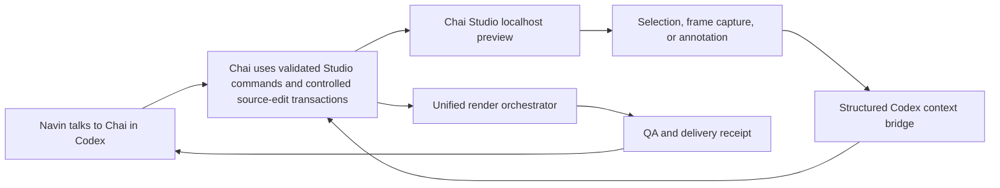
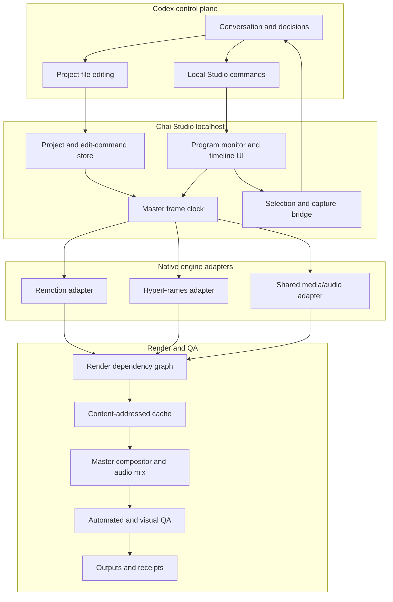
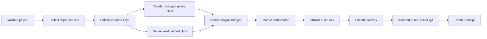

# Chai Studio — Comprehensive Master Plan

**Document status:** Full-scope planning baseline 1.1  
**Last reviewed:** 2026-07-11  
**Implementation status:** Planning only. No application implementation or accepted execution phase is present in this package; see `PROJECT_STATE.md`.  
**Scope:** Product, UX, architecture, feature, rendering, QA, safety, licensing, and delivery plan  
**Execution companion:** `CHAI_STUDIO_FINAL_UPDATED_IMPLEMENTATION_PLAN.md`

> This document is the authoritative full-scope planning baseline for Chai Studio. It covers the complete Foundation and Professional product rather than an MVP. It does not by itself authorize implementation. Decisions marked **Locked** should be preserved unless evidence requires a documented revision. Decisions marked **Spike required** must be tested before the implementation architecture is frozen.

---

## 1. Executive Summary

Chai Studio will be a local, professional video editing, preview, capture, and rendering system operated through Codex.

The user will continue to communicate with Chai only inside Codex. Chai Studio will not contain a separate AI chat interface. Instead, it will provide the visual and rendering surface that Codex can control through project files, a local command interface, and a structured context bridge.

Chai Studio will unify the capabilities of two programmable video engines:

- **Remotion** for React/TypeScript compositions, reusable component systems, programmatic sequences, media composition, and finishing.
- **HyperFrames** for HTML/CSS-native compositions, deterministic seekable animation, GSAP, Lottie, Three.js, Rive, WAAPI, D3, PixiJS, shaders, and agent-friendly motion work.

The engines will remain native and independently upgradeable. Chai Studio will not merge their source code or reduce both engines to a weak shared feature set. It will provide:

- One authoritative project format.
- One integer-frame master timeline.
- One program monitor.
- One multitrack editing interface.
- One capture-to-Codex bridge.
- One render queue.
- One final delivery and QA system.

The first implementation will run as a localhost application. A native desktop wrapper may be added later if it provides real value, but the core product must not depend on Electron, Tauri, or another wrapper.

---

## 2. Vision

### 2.1 Product vision

Chai Studio should feel like a focused professional edit bay whose creative operator is Chai in Codex.

The user should be able to:

1. Talk to Chai in Codex.
2. Open the local Chai Studio preview when visual inspection is useful.
3. Select a clip, track, marker, or exact frame.
4. Capture the real rendered frame or a short review range.
5. Have that context made available to Chai.
6. Ask for a change naturally.
7. See the revised preview.
8. Approve and render the final video.

### 2.2 Core product promise

> One project, one timeline, one preview, one render system, two native engines, and one conversation with Chai in Codex.

### 2.3 What makes Chai Studio distinct

Chai Studio is not simply a skin over Remotion or HyperFrames. Its unique product value is the layer between authoring and rendering:

- Engine-neutral project and timeline semantics.
- Engine-native capabilities preserved through adapters.
- Exact selection and visual context transfer to Codex.
- Deterministic revision, comparison, and audit history.
- Render dependency graph and selective cache invalidation.
- Unified quality gates across mixed-engine videos.
- Clear separation between fast preview and final-render truth.

---

## 3. Locked Product Decisions

The following decisions are locked for the planning baseline:

1. **Codex is the only conversation surface.** There is no chat panel inside Chai Studio.
2. **Chai Studio is local-first.** The first product runs on localhost.
3. **The project model belongs to Chai Studio.** Neither Remotion nor HyperFrames owns the master timeline.
4. **All authoritative timeline positions use integer frames.** Floating-point seconds may be derived for display or engine adapters only.
5. **Both engines remain native.** No mandatory conversion between Remotion and HyperFrames.
6. **Audio has one master authority.** Engine clips do not independently mix the final program audio.
7. **Preview and final-render fidelity are different modes.** The UI must never hide this distinction.
8. **Cross-engine effects use explicit bridge scenes or baked intermediates.** They are not silently approximated.
9. **Project data is human-readable and versionable.** Cache/index databases are never the sole source of truth.
10. **No destructive edit is irreversible.** Undo, autosave, snapshots, and version history are core architecture, not polish.
11. **A captured frame must match the corresponding frame in the final render.** This is a release gate.
12. **Engine upgrades are pinned and tested.** Production never tracks unpinned latest versions.
13. **Authoritative project mutations use validated commands.** Direct edits to authoritative JSON are imported as explicit reversible transactions.
14. **Timeline rates and speed ratios use normalized rational values.** Floating-point timing is not persisted as authority.
15. **Project revisions commit atomically as a coordinated snapshot.** Per-file atomic writes alone are insufficient.
16. **Executable compositions run under an explicit trust and isolation policy.** Imported HTML is untrusted by default.
17. **Full scope means Foundation plus Professional Expansion.** An early vertical slice is a validation gate, not an MVP or stopping point.

---

## 4. Product Boundaries

### 4.1 Chai Studio will be

- A local video project manager.
- A rich multitrack timeline editor.
- A unified Remotion and HyperFrames program monitor.
- A frame-accurate capture and comparison tool.
- A local render orchestrator.
- A render queue and progress surface.
- An asset, proxy, transcript, caption, and audio manager.
- A QA and delivery system.
- A structured control surface for Codex.

### 4.2 Chai Studio will not initially be

- A second AI chat application.
- A full Premiere Pro, After Effects, or DaVinci Resolve replacement.
- A cloud collaboration platform.
- A multi-user review service.
- A generic hosted Remotion rendering service.
- A plugin marketplace.
- A full nodal compositor.
- A professional color-grading suite.
- A mastering-grade digital audio workstation.
- A mobile editor.

These capabilities may be considered later, but none may delay the reliable timeline, capture, rendering, and QA foundation.

### 4.3 Definition of 100% implementation scope

For this plan, **100% implementation** means every feature classified as **Foundation** or **Professional Expansion** in the Feature Priority Matrix is implemented, integrated, documented, and passes its acceptance gates.

The following are not part of the current 100% target unless a later approved revision promotes them into scope:

- Multicam editing.
- Cloud collaboration.
- Public plugin marketplace.
- Full nodal compositor.
- Resolve-grade color system.
- Mastering-grade audio suite.
- Mobile editor.
- Hosted rendering service.

This boundary prevents “100%” from becoming an undefined promise while still committing to the complete professional Chai Studio product described in this document.

---

## 5. Primary User and Operating Model

### 5.1 Primary user

The primary user is Navin, working with Chai through Codex.

The app should therefore optimize for:

- Fast local iteration.
- Precise frame selection.
- Low-friction context transfer.
- Strong visual review.
- Safe automated editing.
- Transparent render status.
- Reproducible outputs.

It does not need to optimize its first release for unfamiliar public users, onboarding funnels, accounts, subscriptions, or social collaboration.

### 5.2 Primary workflow



### 5.3 Manual interaction model

The user may manually:

- Play, pause, scrub, frame-step, and loop.
- Select clips, tracks, markers, keyframes, or ranges.
- Reorder or trim clips when desired.
- Capture or annotate a frame.
- Inspect render status.
- Compare versions.
- Approve a result.

Chai performs authoritative project and timeline mutations through structured commands. Native scene source files may be changed only inside a controlled source-edit transaction that snapshots the prior state, validates the result, records the diff, and creates a reversible history entry. If an external edit is detected outside that protocol, Chai Studio must import it as an explicit external-change transaction before it becomes authoritative.

---

## 6. Upstream Technology Basis

### 6.1 Remotion capabilities we expect to use

- Embeddable React Player for interactive preview.
- Runtime input props and reusable React compositions.
- Programmatic video and still rendering.
- Exact frame still rendering.
- Composition metadata including width, height, FPS, and duration.
- Media, captions, transitions, effects, Three.js, and other ecosystem packages.
- Initial final-compositor role for mixed-engine projects.

Relevant official references:

- Remotion Player: https://www.remotion.dev/docs/player
- Remotion `renderStill()`: https://www.remotion.dev/docs/renderer/render-still
- Remotion `renderMedia()`: https://www.remotion.dev/docs/renderer/render-media
- Remotion license: https://github.com/remotion-dev/remotion/blob/main/LICENSE.md

### 6.2 HyperFrames capabilities we expect to use

- Plain HTML/CSS composition authoring.
- Deterministic virtual seek clock.
- Embeddable preview/player surfaces.
- CLI inspection, linting, preview, and rendering.
- Frame adapters for GSAP, Lottie, Three.js, Rive, WAAPI, D3, PixiJS, and custom runtimes.
- Browser-based Studio components where stable and reusable.
- Producer/engine packages for capture, encode, and audio-related operations.
- Shader transitions and reusable registry components.

Relevant official references:

- HyperFrames documentation: https://hyperframes.video/docs
- HyperFrames preview: https://hyperframes.video/docs/workflow/preview
- HyperFrames timing: https://hyperframes.video/docs/concepts/timing-and-tracks
- HyperFrames frame adapters: https://hyperframes.video/docs/concepts/frame-adapters
- HyperFrames repository: https://github.com/heygen-com/hyperframes

### 6.3 Integration principle

Chai Studio should reuse stable public packages and APIs where appropriate, but it must not tightly couple its authoritative timeline or project format to an upstream Studio UI package that is still evolving.

The recommended boundary is:

- Reuse engine and player primitives.
- Wrap them in Chai Studio adapters.
- Own the master clock and timeline.
- Treat upstream editor UI as a reference or optional component source, not the product foundation.

---

## 7. High-Level Architecture



### 7.1 Recommended implementation layers

1. **Studio web app:** React and TypeScript UI running locally.
2. **Local Studio server:** Node.js/TypeScript process for files, media analysis, commands, rendering, and events.
3. **Timeline core:** Framework-independent model, validation, edit commands, and migrations.
4. **Preview core:** Master clock and preview adapters.
5. **Engine adapters:** Remotion and HyperFrames integrations.
6. **Media core:** Asset registration, metadata, thumbnails, proxies, and waveforms.
7. **Audio core:** Preview and render mix model.
8. **Render orchestrator:** Dependency graph, workers, cache, cancellation, and receipts.
9. **Codex bridge:** Selection, capture, annotations, commands, and context manifests.
10. **QA core:** Automated validation, snapshot comparison, sync checks, and delivery gates.

---

## 8. Proposed Repository Layout

The final location should be confirmed during the implementation bootstrap. A recommended standalone layout is:

```text
Chai Studio/
├── README.md
├── package.json
├── pnpm-workspace.yaml            # Only when pnpm is selected
├── apps/
│   ├── studio-web/                 # Localhost UI
│   └── studio-server/              # Local API, events, files, render jobs
├── packages/
│   ├── project-schema/             # Project, asset, timeline, receipt schemas
│   ├── timeline-core/              # Clock, edit commands, tracks, clips, keyframes
│   ├── preview-core/               # Preview transport and layer compositor
│   ├── engine-remotion/            # Remotion preview/render adapter
│   ├── engine-hyperframes/         # HyperFrames preview/render adapter
│   ├── media-core/                 # Metadata, thumbnails, waveforms, proxies
│   ├── audio-core/                 # Preview and final audio model
│   ├── render-core/                # DAG, cache, jobs, cancellation, receipts
│   ├── codex-bridge/               # Selection/capture/context commands
│   ├── qa-core/                    # Validation and comparison gates
│   └── ui-components/              # Shared editor UI primitives
├── fixtures/                       # Small deterministic test projects
├── docs/                           # Architecture and product decisions
├── scripts/                        # Development and release utilities
└── examples/                       # Mixed-engine example projects
```

### 8.1 Recommended package/runtime baseline

- TypeScript in strict mode.
- Node.js version compatible with the chosen HyperFrames release; currently plan for Node.js 22+.
- React for the Studio UI and Remotion Player host.
- Vite or an equivalent fast local development server.
- A workspace package manager chosen during bootstrap; `pnpm` is recommended, but the final choice should consider the existing environment.
- FFmpeg/ffprobe for media inspection, proxies, audio mixing, and delivery operations where appropriate.
- Zod, JSON Schema, or an equivalent runtime validation layer for every persisted artifact.
- SQLite permitted for cache indexes, search indexes, and ephemeral job state only.

---

## 9. Project File Model

### 9.1 Project folder

Each video project should be self-contained:

```text
project-name/
├── current-revision.json           # Atomically replaced committed-revision pointer
├── revisions/
│   └── revision-000001/
│       ├── chai.project.json
│       ├── timeline.json
│       ├── assets.json
│       ├── settings.json
│       └── transaction.json
├── working/                        # Validated working state, never silently committed
├── scenes/
│   ├── remotion/
│   ├── hyperframes/
│   └── shared/
├── assets/
├── transcripts/
├── captions/
├── captures/
├── reviews/
├── renders/
├── receipts/
├── autosaves/
└── .chai-cache/                    # Regenerable, never authoritative
```

### 9.2 `chai.project.json`

Must contain:

- Schema version.
- Project ID and title.
- Creation and modification timestamps.
- Default dimensions and FPS.
- Color and audio configuration.
- Active timeline file.
- Engine version pins.
- Adapter version pins.
- Project capability flags.
- Active delivery profile.
- Project-level rights/attribution notes.

### 9.3 `timeline.json`

Must contain:

- Timeline schema version.
- Master FPS and duration in frames.
- Ordered tracks.
- Clips and nested sequences.
- Source in/out frames.
- Speed/time mapping.
- Transform and effect references.
- Keyframes.
- Transitions and bridge scenes.
- Markers and annotations.
- Caption and transcript references.
- Audio automation references.
- Approval state.

### 9.4 `assets.json`

Every asset receives a stable ID and records:

- Original path.
- Project-relative path where applicable.
- File hash.
- Media type.
- Container and codec.
- Dimensions, FPS, duration, and time base.
- Audio sample rate and channels.
- Alpha-channel support.
- Variable-frame-rate status.
- Proxy path and proxy profile.
- Thumbnail/contact-sheet paths.
- Rights, license, source, and attribution.
- Registration and validation status.

### 9.5 Human-readable authority

The JSON project artifacts are authoritative. Databases may accelerate operations, but deleting a cache/index database must not lose creative state.

### 9.6 Project revision and transaction protocol

A committed project state is an immutable coordinated revision, not a collection of independently current JSON files.

Each mutation must:

1. Declare `baseRevisionId` for optimistic concurrency.
2. Acquire the project mutation lock or fail clearly.
3. Validate the command and affected entities.
4. Apply the change in an isolated working revision.
5. Validate the complete project, not only the changed file.
6. Write an immutable revision directory containing mutually compatible project artifacts.
7. Record the command, actor, diff summary, parent revision, and resulting hashes in `transaction.json`.
8. Flush and atomically replace `current-revision.json` with the new committed revision pointer.
9. Release the mutation lock.

If the process crashes before the pointer replacement, the previous revision remains current. Orphan working revisions may be inspected and recovered but never become authoritative automatically.

External source edits use the same revision boundary:

- `source-edit begin` snapshots affected native files and hashes.
- Codex applies the source patch.
- `source-edit commit` validates, records the diff, and creates one reversible transaction.
- Detected unwrapped edits enter a quarantined `external_change_pending` state until imported or rejected.

Concurrent commands with a stale `baseRevisionId` must fail with a structured conflict report rather than silently rebasing.

---

## 10. Master Timeline and Clock

### 10.1 Timing model

All edit positions use integer master frames. Frame rates, source time bases, and speed ratios use normalized rational numbers.

```ts
type Rational = {
  numerator: bigint;
  denominator: bigint; // Always positive and non-zero
};
```

Rationals must be reduced to lowest terms when persisted. Examples include `24000/1001`, `30000/1001`, and `60000/1001`.

Required concepts:

- `masterFrame`
- `startFrame`
- `durationInFrames`
- `sourceInFrame`
- `sourceOutFrame`
- `speedRatio: Rational`
- `sourceTimeBase: Rational`
- `timelineFps: Rational`
- `sampleRate` for audio

All ranges are half-open: `[startFrame, endFrame)`. The start frame is included; the end frame is excluded. Clip duration is always `endFrame - startFrame`.

Nested-sequence and speed transforms must be composed using rational arithmetic and may not persist floating-point approximations.

Seconds are calculated only for display or an engine interface:

```text
seconds = masterFrame × timelineFps.denominator / timelineFps.numerator
```

### 10.2 Rounding and conversion rules

- Timeline edit boundaries are exact integer master frames.
- Frame sampling uses the presentation timestamp of the master frame.
- A timeline-frame-to-source-frame lookup uses floor rounding after the exact rational transform unless the source adapter defines a documented deterministic sampling rule.
- A derived duration uses ceiling when necessary to avoid silently truncating covered media.
- Timeline-range-to-audio-sample conversion uses floor for the inclusive start and ceiling for the exclusive end.
- Rounding is applied only at an explicit domain boundary; intermediate calculations retain rational precision.
- Drop-frame timecode affects display labels only. It does not change frame count, FPS, duration, media sampling, or audio synchronization.
- Each nested sequence declares its own rational rate and an exact mapping to the parent timeline.

### 10.3 Variable-frame-rate media

Variable-frame-rate footage must not be trusted directly for frame-accurate editing. The media pipeline should:

1. Detect variable frame rate.
2. Preserve the original file.
3. Generate a constant-frame-rate proxy or mezzanine.
4. Store an explicit source-to-proxy time mapping.
5. Use the original or approved mezzanine for final rendering.

### 10.4 Master scheduler and transport

The transport owns:

- Play.
- Pause.
- Seek.
- Frame step.
- Second step.
- Jump to start/end.
- Loop range.
- Playback speed.
- Audio scrubbing policy.
- Dropped-frame reporting.
- Buffered range reporting.

Neither engine may run its own uncontrolled wall clock while attached to the master preview.

The master scheduler owns the authoritative frame sequence and presentation timestamps. Native player playback may be used only as a performance optimization under a synchronized playback session that defines:

- Initial authoritative frame and monotonic session ID.
- Expected presentation timestamp for every sampled frame.
- Adapter-reported current frame.
- Drift measurement.
- Maximum tolerated drift.
- Pause and seek barriers.
- Hard resynchronization behavior.
- Audio resampling policy.
- Dropped-frame reporting.

Provisional hard-resync threshold: greater than `0.5` master frame or the equivalent audio-sample interval. Milestone 0 must measure and freeze the supported threshold.

---

## 11. Engine Adapter Contract

Each engine adapter should implement a stable Chai Studio interface:

```ts
interface EngineAdapter {
  id: string;
  version: string;
  inspectCapabilities(): Promise<CapabilityReport>;
  validateSource(source: EngineSource): Promise<ValidationReport>;
  loadPreview(context: PreviewContext): Promise<PreviewHandle>;
  preload(range: FrameRange): Promise<void>;
  presentFrame(request: PresentFrameRequest): Promise<PresentedFrame>;
  beginSynchronizedPlayback(session: PlaybackSession): Promise<void>;
  haltSynchronizedPlayback(sessionId: string): Promise<PlaybackState>;
  reportPlaybackState(sessionId: string): Promise<PlaybackState>;
  renderStill(request: StillRenderRequest): Promise<RenderArtifact>;
  renderRange(request: RangeRenderRequest): Promise<RenderArtifact>;
  collectDependencies(source: EngineSource): Promise<DependencySet>;
  dispose(): Promise<void>;
}
```

### 11.1 Remotion adapter

Responsibilities:

- Discover compositions.
- Validate component and input-prop contracts.
- Mount the Remotion Player.
- Seek and report current frame.
- Render exact stills and video ranges.
- Collect referenced assets and fonts.
- Surface common props and native props.
- Report delays, loading failures, and browser logs.
- Support final-compositor composition generation.

### 11.2 HyperFrames adapter

Responsibilities:

- Inspect and validate HTML composition metadata.
- Mount the HyperFrames player/preview.
- Forward the master seek time/frame.
- Detect and report active frame adapters.
- Run HyperFrames lint/validate/inspect operations.
- Render exact stills or ranges.
- Collect HTML, media, font, script, and adapter dependencies.
- Surface declared composition variables.
- Report non-seekable or expensive stateful effects.

### 11.3 Shared adapter

Responsibilities:

- Raw video, image, and audio clips.
- Caption/subtitle clips.
- Solid/color clips.
- Adjustment metadata.
- Markers and annotations.
- Timeline-native transitions.
- Shared transform, opacity, crop, and blend properties.

---

## 12. Capability Registry

Every capability must be classified per engine:

- `native`
- `unified`
- `bake_required`
- `fallback_available`
- `unsupported`
- `experimental`

Example capability families:

- Layout and typography.
- Images and video.
- Captions.
- Audio.
- React components.
- HTML/CSS.
- SVG.
- Canvas.
- Lottie and Rive.
- GSAP and WAAPI.
- Three.js/WebGL.
- Shaders.
- Physics/particles.
- Transitions.
- Alpha output.
- HDR and color depth.
- Distributed rendering.

The capability registry should drive:

- Inspector controls.
- Preview warnings.
- Render planning.
- Fallback selection.
- Upgrade regression tests.
- User-visible badges only when relevant.

---

## 13. Unified Preview System

### 13.1 Preview modes

#### Interactive mode

Optimized for editing speed:

- Native players where possible.
- Proxy media.
- Reduced preview resolution.
- Cached thumbnails and short preview segments.
- Dropped-frame detection.
- Approximation warnings for baked-required effects.

#### Rendered-fidelity mode

Optimized for truth:

- Exact selected frame.
- Exact short range.
- Final compositor path.
- Final fonts, effects, blending, and color configuration.
- Appropriate audio mix for range review.

The program monitor must clearly label the active mode.

### 13.2 Preview layer compositor

The local program monitor should support:

- Native Remotion preview layers.
- Native HyperFrames preview layers.
- Shared media layers.
- Canvas overlays for guides and annotations.
- Proxy/baked fallback layers.
- Deterministic z-order.
- Common transforms and opacity.
- Letterbox/pillarbox handling.

### 13.3 Preview integrity

The UI must report:

- Buffering.
- Dropped frames.
- Stale cache.
- Missing asset.
- Missing font.
- Unsupported effect.
- Proxy in use.
- Native versus baked preview.
- Render-required difference.

### 13.4 Capture fidelity contract

Chai Studio defines two comparison contracts:

#### Strict same-environment parity

A `fidelity_capture` must run through the same compositor implementation, render settings, color configuration, environment fingerprint, and dependency graph as the associated delivery render. Both outputs are decoded into the same normalized pixel representation before comparison.

Required comparison basis:

- Declared color space and transfer function.
- Declared alpha mode: straight or premultiplied.
- Declared bit depth and pixel format.
- Same frame index and half-open range semantics.
- Same decoder and normalization path.
- Exact normalized pixel hash unless the approved renderer is documented as nondeterministic.

#### Supported cross-environment parity

When different supported GPU/OS/render backends cannot guarantee byte-identical pixels, comparison uses approved perceptual metrics and fixture-specific tolerances. Milestone 0 must establish the initial SSIM/perceptual-difference thresholds from real fixtures; the plan must not invent a passing tolerance before measurement.

Every capture records its `strictEnvironmentFingerprint`, compositor ID, render settings, color contract, and comparison mode. A fast preview screenshot is never labeled fidelity-equivalent.

---

## 14. Timeline Editor

### 14.1 Track types

- Video/visual.
- Overlay.
- Adjustment/effects.
- Captions.
- Voiceover.
- Music.
- SFX.
- Ambience.
- Markers/notes.
- Automation.
- Nested sequence.

### 14.2 Core edit operations

Required for the first professional release:

- Select and multi-select.
- Move.
- Insert.
- Overwrite.
- Replace.
- Split/blade.
- Trim in/out.
- Ripple trim.
- Ripple delete.
- Lift.
- Duplicate.
- Copy/paste.
- Group/ungroup.
- Link/unlink audio and video.
- Nudge by frame.
- Snap to playhead, markers, clips, captions, and phrases.
- Lock, hide, mute, and solo tracks.
- Add/remove tracks.
- Rename tracks and clips.
- Set in/out range.
- Loop selection.
- Undo/redo.

### 14.3 Advanced edit operations

Planned after core stability:

- Roll edit.
- Slip edit.
- Slide edit.
- Replace edit from source monitor.
- Three-point editing.
- Compound/nested clips.
- Alternate takes and version stacks.
- Freeze frame.
- Reverse.
- Speed change.
- Time remapping and speed curves.
- Adjustment layers.
- Range-based effects.

### 14.4 Timeline visuals

- Filmstrip thumbnails.
- Audio waveforms.
- Caption text blocks.
- Clip labels.
- Small engine indicator.
- Transition handles.
- Selection outline.
- Render/cache state.
- Warning/error state.
- Source in/out indicators on demand.
- Keyframe indicators.
- Marker lane above the ruler.
- Current phrase highlight.

### 14.5 Timeline navigation

- Horizontal and vertical zoom.
- Fit entire timeline.
- Fit selected range.
- Jump to previous/next edit.
- Jump to previous/next marker.
- Jump to previous/next caption or phrase.
- Search and jump by clip name, asset, transcript, or marker.

---

## 15. Program Monitor and Source Monitor

### 15.1 Program monitor

Must include:

- Final composite preview.
- Frame/timecode display.
- Playback controls.
- Resolution/FPS display.
- Preview-mode label.
- Safe zones.
- Grid and guides.
- Zoom and pan.
- Background/transparency checker.
- Fullscreen mode.
- Capture control.
- Before/after comparison.
- A/B version comparison.
- Optional scopes later.

### 15.2 Source inspection and source monitor

Foundation source inspection includes:

- View source video, image, Remotion composition, or HyperFrames composition.
- Scrub and frame-step independently without owning or changing the master timeline clock.
- Inspect source metadata.
- Audition safe composition variables or props without committing an edit.
- Add source context or captures to the Codex bridge.

Professional source editing adds:

- Set source in/out.
- Patch source tracks to target tracks.
- Insert, overwrite, and replace into the master timeline.
- Perform validated three-point edits.

---

## 16. Inspector System

The inspector should use progressive disclosure rather than displaying every possible control permanently.

### 16.1 Common inspector

- Name and stable ID.
- Track and timeline range.
- Source in/out.
- Position.
- Scale.
- Rotation.
- Anchor point.
- Opacity.
- Crop.
- Blend mode.
- Speed.
- Volume.
- Fade handles.
- Common keyframes.

### 16.2 Remotion-native inspector

- Composition ID.
- Input props.
- Calculated metadata.
- Component/source path.
- Composition dimensions/FPS/duration.
- Remotion-specific warnings.
- Render dependency summary.

### 16.3 HyperFrames-native inspector

- Composition ID.
- HTML source path.
- Declared variables.
- Active tracks.
- Frame adapters.
- Timing attributes.
- Lint/validation status.
- HyperFrames-specific warnings.

### 16.4 Multi-selection inspector

Shows only properties that can safely apply to every selected item and clearly indicates mixed values.

---

## 17. Animation and Keyframes

### 17.1 Common keyframes

Chai Studio should provide common keyframe curves for:

- Position.
- Scale.
- Rotation.
- Opacity.
- Crop.
- Volume.
- Blur/effect intensity where supported.

### 17.2 Curve editor

Professional release requirements:

- Linear, hold, ease, ease-in, ease-out.
- Cubic-bezier handles.
- Value graph.
- Speed graph where practical.
- Copy/paste keyframes.
- Align/distribute keyframes.
- Retime selected keyframes.

### 17.3 Native animation preservation

Native Remotion or HyperFrames animation code remains authoritative unless the user explicitly converts a property to shared Chai Studio keyframes.

The UI must not imply that every native animation can be edited safely through generic controls.

---

## 18. Transitions and Engine Bridges

### 18.1 Transition types

- Hard cut.
- Cross dissolve.
- Dip to color.
- Wipe.
- Push/slide.
- Zoom.
- Blur.
- Light leak.
- Film burn.
- Shader transition.
- Custom native transition.

### 18.2 Bridge-scene object

Cross-engine transitions must define:

- Outgoing clip and sampled range.
- Incoming clip and sampled range.
- Transition duration.
- Owning engine.
- Required alpha/pixel format.
- Audio transition envelope.
- Fallback transition.
- Cache key.
- Validation state.

### 18.3 Bridge rules

- No hidden automatic conversion.
- Fallback required for experimental shaders.
- No duplicated or missing boundary frame.
- Pre-roll and post-roll requirements must be explicit.
- Preview approximation must be labeled.

---

## 19. Media and Asset System

### 19.1 Supported asset families

- Video.
- Image.
- Audio.
- Fonts.
- SVG.
- Lottie/dotLottie.
- Rive.
- 3D models and textures.
- LUTs where later supported.
- Scripts/data files.
- Captions and transcripts.
- Generated intermediates.

### 19.2 Media bin features

- Folder and collection views.
- Search.
- Filter by type, duration, resolution, rights, or status.
- Sort by name, date, duration, or use count.
- Thumbnail/contact sheet.
- Audio preview and waveform.
- Metadata inspector.
- Reveal in file system.
- Show timeline usage.
- Replace/relink missing media.
- Detect duplicates by hash.
- Mark favorite/approved/rejected.

### 19.3 Proxy system

- Configurable proxy profiles.
- Automatic background generation.
- Visible proxy status.
- Original/proxy relinking.
- Source-time mapping.
- Cache invalidation when source changes.
- Never export proxy media accidentally.

### 19.4 Rights and attribution

Every external asset should support:

- Source URL.
- Creator/owner.
- License.
- Usage restrictions.
- Attribution text.
- Proof or receipt reference.
- Expiry or review date where applicable.

---

## 20. Transcript and Caption System

### 20.1 Transcript model

- Word timestamps.
- Phrase/sentence timestamps.
- Speaker labels.
- Confidence.
- Correction state.
- Locked versus editable text.
- Link to audio source.

### 20.2 Transcript interactions

- Click phrase to seek.
- Search text and jump.
- Create marker from phrase.
- Split clip at phrase boundary.
- Select phrase range.
- Generate caption block.
- Compare transcript to locked script when available.

### 20.3 Caption features

- SRT/VTT import/export.
- Burned-in captions.
- Separate subtitle delivery.
- Line and word highlighting.
- Styling templates.
- Safe-zone validation.
- Maximum line length and reading-speed checks.
- Caption collision detection.
- Phrase-accurate editing.

---

## 21. Audio System

### 21.1 One audio authority

The master audio model belongs to Chai Studio.

Native engine audio may be previewed for source inspection, but the final program audio should be represented in the shared timeline unless a documented exception is approved.

### 21.2 Audio features

- Waveforms.
- Sample-rate metadata.
- Gain.
- Mute/solo.
- Fades.
- Crossfades.
- Pan.
- Keyframed volume.
- Ducking.
- Loudness measurement.
- Peak/clipping detection.
- Channel mapping.
- Voiceover/music/SFX/ambience buses.
- Sync markers.
- Optional noise reduction or normalization as explicit preprocessing.

### 21.3 Preview and final mix

- Web Audio or an equivalent low-latency model for preview.
- Deterministic offline/FFmpeg-based or equivalent mix for final rendering.
- Preview and final mix settings derived from one authoritative audio graph.
- Sample-accurate test coverage for long timelines.

---

## 22. Codex Context Bridge

### 22.1 Purpose

The bridge makes the Studio's visual state inspectable and actionable from Codex without adding a chat interface to the Studio.

### 22.2 Selection manifest

When the user selects an item, the Studio records:

- Project ID.
- Timeline version.
- Selected clip/track/marker/keyframe IDs.
- Master frame and timecode.
- Source frame/time.
- Engine.
- Source files.
- Input props or variables.
- Active effects and transitions.
- Nearby clips.
- Current preview mode.
- Current capture paths.
- Annotation paths.

### 22.3 Capture types

- Final composite frame.
- Selected clip isolated.
- Before effects.
- Alpha/transparency view.
- Before/after comparison.
- A/B version comparison.
- Short review range.
- Contact sheet around current frame.

`Final composite frame` is divided into `interactive_preview_capture` and `fidelity_capture`; only the latter may be tested against final delivery parity.

### 22.4 Annotation tools

- Point.
- Rectangle.
- Arrow.
- Freehand stroke.
- Text note.
- Blur/privacy region.
- Color-coded issue category.

Annotation coordinates must be stored in normalized composition space so they remain accurate across monitor scaling.

### 22.5 Bridge operations

Proposed local commands:

```text
chai-studio status
chai-studio selection get
chai-studio selection set --clip <id> --frame <n>
chai-studio capture --current --mode composite
chai-studio capture --range <start>:<end>
chai-studio context latest --json
chai-studio preview start
chai-studio render start --profile youtube-1080p
chai-studio render status --latest
chai-studio qa latest
```

Direct unsolicited injection into a Codex conversation must not be assumed. The reliable baseline is a structured local context artifact and command that Codex can retrieve immediately.

---

## 23. Render Orchestrator

### 23.1 Render dependency graph



### 23.2 Render stages

1. Validate schema and timeline.
2. Verify engine versions and adapters.
3. Verify every referenced asset.
4. Resolve fonts and external dependencies.
5. Calculate clip, bridge, audio, and delivery cache keys.
6. Reuse valid cache artifacts.
7. Render changed engine-native clips.
8. Render bridge scenes.
9. Build the master compositor input.
10. Mix audio.
11. Encode the requested profile.
12. Generate stills, thumbnail, and contact sheet.
13. Run QA.
14. Write receipt and update latest pointers.

### 23.3 Initial finishing compositor

**Recommended:** Use Remotion as the initial finishing compositor for mixed-engine projects, consuming HyperFrames intermediates where necessary.

The render-core API must keep the compositor replaceable so Chai Studio can later introduce a custom compositor or another finishing path without rewriting project files.

### 23.4 Intermediate formats

Selection depends on the clip:

- Normal video: high-quality intraframe or suitable mezzanine.
- Transparent overlay: verified alpha-capable format.
- Static or fragile effect: PNG/WebP/image sequence where justified.
- Audio: lossless intermediate.

Intermediate policy must consider quality, alpha, seek speed, disk cost, and compatibility.

---

## 24. Content-Addressed Cache

### 24.1 Cache-key inputs

- Source file content hashes.
- Composition source hashes.
- Input props/variables.
- Asset hashes.
- Font hashes.
- Engine version.
- Adapter version.
- Dimensions and FPS.
- Color/pixel configuration.
- Render quality.
- Transition and bridge configuration.
- Audio graph segment.
- Strict environment fingerprint or approved compatible-preview fingerprint.
- Browser and renderer binary versions.
- FFmpeg build, linked codec set, and compositor binary versions.
- OS, architecture, and GPU/render backend where pixel output can differ.
- Locale, timezone, color profile, and relevant environment variables.
- Random seeds and deterministic simulation inputs.
- Lockfile hash and transitive runtime dependency graph hash.
- Resolved font files and hashes.
- Approved network-resource content hashes.

### 24.2 Environment fingerprints

Use two explicit fingerprints:

- `strictEnvironmentFingerprint`: exact rendering environment used for final cache, fidelity captures, receipts, and strict reproducibility.
- `compatiblePreviewFingerprint`: a documented compatibility class that may reuse non-final preview artifacts when exact pixel identity is unnecessary.

Final-render cache reuse requires the strict fingerprint unless an artifact class has a proven, tested portability contract.

### 24.3 Cache behavior

- Changing one title should invalidate only dependent artifacts.
- Deleting the cache should not lose project state.
- Cache hits and misses should be visible in render diagnostics.
- Stale cache must be detected, not guessed.
- Cache cleanup must be safe and configurable.
- Render receipts must record which artifacts were reused.

---

## 25. Render Queue and Delivery

### 25.1 Render queue UI

- Job name.
- Full timeline or range.
- Delivery profile.
- Progress by stage and clip.
- Active engine.
- Cache hits.
- Estimated remaining work, labeled as an estimate.
- Pause/cancel where supported.
- Retry failed stage.
- Error details.
- Output paths.
- QA state.

### 25.2 Delivery profiles

- YouTube 1080p.
- YouTube 4K.
- Review proxy.
- YouTube Shorts 9:16.
- Square 1:1.
- Transparent overlay.
- Master/mezzanine.
- Still frame.
- Thumbnail.
- Image sequence.
- Audio-only.
- Custom profile.

### 25.3 Render receipt

Every completed render must record:

- Project and timeline version.
- Render job ID.
- Start/end time.
- Output profile.
- Engine and adapter versions.
- Strict environment fingerprint and compatible-preview fingerprint where used.
- Browser, renderer, FFmpeg/compositor, OS/architecture, GPU backend, locale/timezone, lockfile, font, seed, and approved network-resource identity required by the fingerprint contract.
- Source and dependency hashes.
- Cache artifacts used.
- Output paths and hashes.
- Audio measurements.
- QA results.
- Warnings and accepted exceptions.
- Approval status.

---

## 26. QA System

### 26.1 Pre-render validation

- Schema valid.
- No missing media.
- No invalid frame ranges.
- No negative or zero unintended durations.
- No unresolved engine capabilities.
- No missing fonts.
- No broken composition.
- No unapproved proxy-as-final source.
- No unsupported alpha configuration.
- Audio graph valid.
- Delivery path writable.

### 26.2 Post-render automated QA

- File exists and is readable.
- Expected duration.
- Expected dimensions and FPS.
- Expected codec/container.
- Audio present when required.
- No unexpected silence.
- No clipping.
- Frame count correct.
- Start/end frame not blank.
- Snapshot hashes or perceptual comparisons for regression anchors.
- No proxy watermark or proxy source in final.

### 26.3 Visual QA

- Boundary-frame review.
- Captured phrase anchors.
- Transition midpoint frames.
- Caption readability and collision.
- Safe-zone checks.
- Alpha edges.
- Shader artifacts.
- Repetition and continuity.
- Color consistency.
- Final first and last frames.

### 26.4 Sync QA

- VO phrase to visual anchor.
- Caption to transcript.
- Music/SFX cues.
- Long-timeline drift.
- Cross-engine boundary alignment.

### 26.5 QA gates

No render is marked delivered merely because encoding succeeded.

States:

- `rendered_unchecked`
- `qa_failed`
- `qa_warning`
- `qa_passed`
- `approved`
- `delivered`

---

## 27. Undo, Autosave, and Versioning

### 27.1 Command-based editing

Every timeline edit should be represented as a reversible command:

- Command ID.
- Actor.
- Timestamp.
- Before state reference.
- After state reference.
- Affected entities.
- Human-readable summary.

Authoritative project JSON may not be changed directly during normal operation. The command layer is the sole normal mutation API.

Native Remotion/HyperFrames source changes must run inside a `source-edit` transaction. The transaction snapshots the previous source set, validates the new source set, records hashes and diffs, invalidates dependent cache, and creates one reversible project revision. This preserves Codex's ability to edit code without bypassing undo and audit history.

### 27.2 Undo/redo

- Multi-step.
- Persists during a session.
- Clear history labels.
- Safe around asynchronous operations.
- Separate edit history from render history.

### 27.3 Autosave

- Debounced autosave after stable edits.
- Immediate snapshot before risky structural edits.
- Recovery prompt after crash.
- Rotating autosave retention.
- Never overwrite the last known-good approved version without a recovery path.

### 27.4 Named versions

- Draft.
- Review.
- Approved.
- Delivery candidate.
- Delivered.

Named versions should reference immutable timeline/project snapshots.

### 27.5 Schema migrations

- Every persisted artifact includes a schema version.
- Migrations are explicit, testable, and reversible where practical.
- Automatic migration creates a backup.
- Old projects must fail with a clear explanation rather than silently reinterpret timing.

---

## 28. UI and Interaction Design

### 28.1 Layout principle

The monitor and timeline dominate. Asset and inspector panels support the edit and can collapse.

Recommended desktop layout:

```text
┌────────────────────────────────────────────────────────────────────┐
│ Project · timecode · preview mode · render status                 │
├───────────────┬───────────────────────────────┬────────────────────┤
│ Project/media │ Program monitor               │ Inspector          │
│ browser       │                               │ Common / Native    │
├───────────────┴───────────────────────────────┴────────────────────┤
│ Markers and ruler                                                  │
│ Rich multitrack timeline                                           │
│ Waveforms · captions · thumbnails · effects · engine bridges       │
└────────────────────────────────────────────────────────────────────┘
```

### 28.2 Workspace modes

- **Edit:** Program monitor, timeline, media, common/native inspector.
- **Inspect:** Exact captures, metadata, comparison, scopes, warnings, annotations.
- **Deliver:** Render queue, output profiles, QA, receipts.

### 28.3 Engine presentation

Do not over-brand clips with engine names.

- Small indicator on clip.
- Engine visible in inspector.
- Warning when bake/fallback is required.
- Bridge scenes clearly designated.
- Creative labels remain primary.

### 28.4 Selection behavior

- Selection persists while inspecting.
- Multi-selection shows safe shared controls.
- Program monitor highlights selected layer when requested.
- Timeline and inspector remain synchronized.
- Selection manifest updates for Codex.

### 28.5 Capture UX

Capture should be available:

- Near the program monitor.
- In the monitor context menu.
- With keyboard shortcut `C`.
- Through Codex/local command.

Advanced capture modes should be available through a compact menu, not permanent buttons.

### 28.6 UI quality principles

- Professional density without clutter.
- Contextual controls.
- Resizable panels.
- Strong keyboard operation.
- Clear selected/focused/disabled states.
- Visible errors with direct remedies.
- No fake success states.
- No ambiguous proxy/final status.
- Dark and light theme support eventually; initial theme should optimize long editing sessions.

---

## 29. Keyboard and Accessibility Plan

### 29.1 Core shortcuts

- `Space`: Play/pause.
- `Left/Right`: Previous/next frame.
- `Shift + Left/Right`: Previous/next second.
- `J/K/L`: Reverse/pause/forward shuttle.
- `I/O`: Mark in/out.
- `C`: Capture current frame.
- `M`: Add marker.
- `B`: Blade tool.
- `V`: Selection tool.
- `Delete`: Delete according to active edit mode.
- `Cmd/Ctrl + Z`: Undo.
- `Cmd/Ctrl + Shift + Z`: Redo.
- `+/-`: Timeline zoom.
- `Home/End`: Timeline start/end.

Shortcuts must be configurable before public release.

### 29.2 Accessibility

- Keyboard-operable timeline and controls.
- Visible focus indicators.
- Screen-reader names for transport and inspector controls.
- High-contrast state indicators.
- Color never used as the only status signal.
- Reduced-motion UI preference.
- Scalable interface text.
- Captions for instructional media.

---

## 30. Performance Plan

### 30.1 Performance goals

Initial targets must be validated on the actual development machine, then recorded as baselines.

Target classes:

- Studio cold start.
- Project open time.
- Seek response.
- Frame-step response.
- Timeline interaction latency.
- Proxy generation throughput.
- Exact still capture time.
- Render throughput.
- Memory ceiling.
- Cache hit effectiveness.

### 30.2 Performance techniques

- Proxy media.
- Thumbnail and waveform caches.
- Lazy source loading.
- Preload around playhead.
- Virtualized timeline rows and clips.
- Worker processes for media analysis and rendering.
- Content-addressed cache.
- Persistent compatible browser process where safe.
- Render concurrency limits.
- GPU capability detection.
- Lower preview quality under load.

### 30.3 Honest degradation

When real-time preview cannot keep up, the Studio should:

1. Report dropped frames.
2. Reduce preview quality if permitted.
3. Offer a rendered preview range.
4. Never imply real-time playback was frame-perfect.

---

## 31. Reliability and Recovery

- Validate before mutation.
- Immutable coordinated revision snapshots.
- Atomically replaced current-revision pointer.
- Optimistic concurrency through `baseRevisionId`.
- Mutation lock with stale-lock recovery rules.
- Atomic writes for files inside a pending revision.
- Temporary files renamed only after successful write.
- Crash-safe autosaves.
- Cancelable render jobs.
- Resumable render graph stages.
- Cleanup of orphan temporary files.
- Missing-media relink flow.
- Font-resolution diagnostics.
- Browser/runtime health checks.
- Disk-space preflight.
- Project repair report before automatic repair.
- Never delete user sources as cache cleanup.

---

## 32. Security and Privacy

### 32.1 Local-first safety

- Bind local server to loopback by default.
- No LAN exposure unless explicitly requested.
- Restrict file operations to opened project roots and approved external assets.
- Validate paths against traversal.
- Do not execute arbitrary downloaded scripts without review.
- Treat HTML composition code as executable local content.
- Classify compositions as `trusted_authored` or `imported_untrusted`.
- Deny network access by default; use an explicit per-project/domain allowlist when required.
- Expose only allowlisted environment variables with secrets excluded by default.
- Mount project sources read-only in preview/render workers where the operation does not require writes.
- Deny filesystem access outside approved project and dependency roots.
- Enforce CSP, navigation, popup, download, and external-protocol restrictions.
- Run imported compositions in isolated subprocesses with CPU, memory, wall-time, process-count, and output-size limits.
- Separate trusted and untrusted worker pools and caches.
- Disable broad `file://` access and unapproved local service access.
- Record policy profile and violations in render receipts.

Isolation is mandatory for imported executable compositions. Platform-specific containment mechanisms must be selected and verified during Milestone 0; inability to provide an approved containment profile blocks imported-composition support.

### 32.2 Codex bridge safety

- Read-only selection and capture operations may run automatically.
- Destructive file deletion or project-wide replacement requires clear authorization.
- Render/export may run on request.
- Publishing/uploading is outside the local baseline and requires explicit authorization.
- Bridge logs must not include secrets or unrelated user files.

### 32.3 External resources

For reproducible final renders:

- Prefer local pinned assets.
- Record downloaded dependency source and hash.
- Avoid runtime dependence on mutable CDN resources.
- Bundle approved fonts/scripts where licensing allows.

---

## 33. Licensing and Compliance

### 33.1 HyperFrames

HyperFrames is currently published under Apache 2.0. Preserve required notices and track any bundled third-party component licenses independently.

### 33.2 Remotion

Remotion uses its own source-available license rather than a standard open-source license. Before commercialization, team growth, public distribution, or automated production at scale:

- Re-check the current Remotion license.
- Confirm team-size and automation/render obligations.
- Avoid selling or redistributing a prohibited derivative.
- Preserve the abstraction layer between end users and raw Remotion projects.

The abstraction layer is an architectural and product boundary; it does not by itself guarantee license compliance. Before every public distribution model or commercial scaling change, the actual product behavior and current Remotion terms must be reviewed together. The plan must also re-evaluate announced Remotion 5 licensing changes before upgrading.

### 33.3 FFmpeg and codecs

The legal obligations of an FFmpeg build depend on its configuration and linked codecs. Distribution planning must review the exact binary and codec licenses.

### 33.4 Assets and fonts

Chai Studio should track rights and attribution but cannot guarantee rights automatically. Final responsibility remains with the project owner.

---

## 34. Testing Strategy

### 34.1 Unit tests

- Frame/time conversion.
- Edit commands.
- Ripple behavior.
- Track ordering.
- Clip overlap rules.
- Cache-key calculation.
- Schema validation.
- Migrations.
- Audio automation math.
- Capability registry.

### 34.2 Integration tests

- Remotion preview seek.
- HyperFrames preview seek.
- Mixed-engine master seek.
- Still capture.
- Range render.
- Bridge render.
- Audio mix.
- Proxy/original relink.
- Missing asset handling.
- Cancel/retry render.

### 34.3 Visual regression tests

- Golden frames at important positions.
- Cross-engine boundary frames.
- Caption layouts.
- Alpha edges.
- Shader transitions.
- Common transform controls.
- Before/after comparison correctness.

Use perceptual thresholds where byte-identical rendering is not a valid cross-platform expectation, and record why.

### 34.4 End-to-end tests

- Create project.
- Import media.
- Add Remotion clip.
- Add HyperFrames clip.
- Edit timeline.
- Capture frame.
- Reopen project.
- Render final.
- Run QA.
- Reproduce output from receipt.

### 34.5 Soak and stress tests

- Long timeline playback.
- Repeated seek.
- Hundreds of clips.
- Long render with cancellation/retry.
- Low disk space.
- Missing/corrupt media.
- Browser process restart.
- Cache cleanup during normal operation.

---

## 35. Non-Negotiable Acceptance Tests

Chai Studio is not considered reliable until:

1. Seeking to the same frame repeatedly produces the same intended visual.
2. Remotion and HyperFrames clips remain aligned after repeated play, pause, and scrub operations.
3. A `fidelity_capture` matches the corresponding frame in the final render under the declared strict same-environment or approved cross-environment parity contract.
4. Cross-engine bridges have no duplicated, missing, or blank boundary frames.
5. Audio remains aligned across a long mixed-engine timeline.
6. Undo restores both the visible timeline and saved project state.
7. Closing and reopening reproduces the same project.
8. Changing one clip invalidates only its dependent cache artifacts.
9. Missing media fails visibly before final rendering.
10. Proxy media cannot silently enter final delivery.
11. Engine upgrades run compatibility and regression tests before adoption.
12. Every final render produces a complete receipt.
13. Canceling a render does not corrupt the project or valid cache.
14. A crash can recover the latest valid autosave.
15. No render is marked delivered solely because encoding succeeded.

---

## 36. Observability and Diagnostics

### 36.1 Development diagnostics

- Structured logs.
- Correlation IDs for render jobs.
- Stage timing.
- Engine browser logs.
- Cache hit/miss reason.
- Memory and concurrency information.
- Media probe results.
- Validation reports.

### 36.2 User-facing diagnostics

- Plain-language error summary.
- Affected clip/asset.
- Exact stage.
- Suggested repair.
- Link or action to inspect source.
- Retry when safe.
- Detailed log available without overwhelming the primary UI.

### 36.3 Privacy

Diagnostics remain local by default. Any future telemetry must be opt-in, documented, minimal, and separate from upstream licensing telemetry obligations.

---

## 37. Upgrade Management

### 37.1 Version pinning

Pin:

- Remotion packages.
- HyperFrames packages.
- Browser/runtime dependencies.
- FFmpeg strategy.
- Fonts and external scripts used by fixtures.

### 37.2 Upgrade workflow

1. Detect or intentionally request an upstream update.
2. Create an isolated upgrade branch/worktree.
3. Update one engine family at a time.
4. Run type checks and unit tests.
5. Run adapter contract tests.
6. Render fixture projects.
7. Compare golden frames and audio sync.
8. Benchmark performance.
9. Update capability registry.
10. Promote or reject with a written receipt.

### 37.3 Upstream patches

Avoid modifying upstream core where wrappers or adapters are sufficient. If a patch is necessary:

- Keep it small.
- Document the reason.
- Test it separately.
- Prefer contributing it upstream when licensing and project direction permit.

---

## 38. Milestone Plan

No milestone should begin until the previous milestone's hard gate passes.

Completion of an early vertical slice does not satisfy Version 1 or the 100% product commitment. It exists only to retire architectural risk before the full Foundation and Professional Expansion are implemented.

### Milestone 0 — Technical spikes and contracts

Deliverables:

- Confirm local stack and package manager.
- Prototype master seek with one Remotion and one HyperFrames composition.
- Test mixed-layer preview feasibility.
- Test exact still capture from both engines.
- Test transparent intermediate compatibility.
- Decide initial final-compositor path.
- Freeze adapter contract v1.
- Freeze project/timeline schema v1 draft.
- Freeze rational time, half-open range, and rounding rules.
- Prototype coordinated project revision commits and crash recovery.
- Prototype trusted and imported-untrusted composition isolation.
- Capture strict and compatible environment fingerprints.
- Establish measured performance and fidelity budgets on the supported development machine.

Provisional Milestone 0 measurement gates, to be confirmed or revised by recorded evidence:

- Warm proxy seek latency: p95 at or below 150 ms on the mixed-engine fixture.
- Frame-step response: p95 at or below 100 ms for a preloaded fixture range.
- Warm exact native still capture: p95 at or below 5 seconds per engine.
- Cold exact native still capture: p95 at or below 15 seconds per engine.
- Preview synchronization drift: no more than 0.5 master frame during a 10-minute playback fixture before hard resync.
- Audio drift: no more than 10 ms during the same fixture, with exact sample-boundary results verified offline.
- Strict same-environment fidelity: exact normalized pixel equality for deterministic fixture frames.
- Memory and GPU budgets: measured during the spike and frozen per supported hardware class before Milestone 1.

Gate:

- Both engines can be driven from one rational-rate, integer-frame controller in a repeatable fixture; transaction recovery, environment fingerprinting, and executable-composition isolation pass their spike gates; performance measurements are recorded.

### First usable vertical slice — validation gate only

This slice is produced across Milestones 0–2 and is not an MVP release. It must demonstrate:

- One Remotion clip and one HyperFrames clip on one master timeline.
- Rational FPS support including at least one `30000/1001` fixture.
- Play, pause, seek, and frame-step from the master scheduler.
- Engine-native exact still capture.
- One reversible command persisted through a coordinated revision.
- Project reopen without state drift.
- Imported-untrusted composition blocked or isolated by policy.

The project proceeds through every remaining milestone even after this slice passes.

### Milestone 1 — Project and timeline foundation

Deliverables:

- Project folder format.
- Schema validation and migrations.
- Timeline core.
- Edit command model.
- Undo/redo.
- Autosave and recovery.
- Basic media registry.

Gate:

- A project can be edited, saved, closed, reopened, and compared without state drift.

### Milestone 2 — Unified preview

Deliverables:

- Localhost Studio shell.
- Program monitor.
- Master transport.
- Remotion preview adapter.
- HyperFrames preview adapter.
- Shared media adapter.
- Preview-mode labeling.
- Basic timeline UI.

Gate:

- Mixed-engine clips stay aligned through seek, play, pause, and frame-step fixture tests.

### Milestone 3 — Core editing

Deliverables:

- Multitrack timeline.
- Select, move, trim, split, ripple, snap, lock, mute, and solo.
- Common inspector.
- Native inspectors.
- Thumbnails, waveforms, captions, and markers.
- Keyboard controls.

Gate:

- Core edit operations are reversible and persist correctly.

### Milestone 4 — Codex bridge and review

Deliverables:

- Selection manifest.
- Exact frame capture.
- Isolated/composite/before-after modes.
- Annotations.
- Local context commands.
- A/B version comparison.

Gate:

- A selected engine-native exact capture and interactive composite capture can be retrieved with complete source context. Each native fidelity capture matches its engine-native reference under the strict same-environment contract.

### Milestone 5 — Render graph and delivery

Deliverables:

- Dependency graph.
- Content-addressed cache.
- Native clip renders.
- Bridge renders.
- Master composition.
- Central audio mix.
- Render queue.
- Delivery profiles.
- Receipts.

Gate:

- A mixed-engine fixture renders reproducibly, selectively reuses cache, produces a receipt, and its `fidelity_capture` matches the corresponding final-compositor frame under the declared strict or approved cross-environment parity contract.

### Milestone 6 — QA and hardening

Deliverables:

- Automated preflight.
- Post-render QA.
- Snapshot regression system.
- Sync checks.
- Crash recovery.
- Stress/soak testing.
- Upgrade compatibility suite.

Gate:

- All non-negotiable acceptance tests pass on supported development environments.

### Milestone 7 — Professional editing expansion

Deliverables:

- Roll/slip/slide edits.
- Compound clips.
- Keyframe curve editor.
- Adjustment layers.
- Speed/time remapping.
- Advanced transitions and bridge editor.
- Audio automation expansion.
- Source monitor and three-point editing.

Gate:

- Advanced features do not weaken deterministic project state or render reproducibility.

---

## 39. Full-Scope Feature Delivery Matrix

| Feature family                | Foundation | Professional expansion | Out-of-scope candidate |
| ----------------------------- | ---------: | ---------------------: | ---------------------: |
| Master frame clock            |   Required |                        |                        |
| Remotion/HyperFrames adapters |   Required |                        |                        |
| Program monitor               |   Required |               Enhanced |                        |
| Core multitrack editing       |   Required |               Enhanced |                        |
| Exact capture to Codex        |   Required |               Enhanced |                        |
| Asset registry/proxies        |   Required |               Enhanced |                        |
| Captions/transcript           |   Required |               Enhanced |                        |
| Central audio                 |   Required |               Enhanced |     Advanced mastering |
| Render graph/cache            |   Required |               Enhanced |      Distributed/cloud |
| QA and receipts               |   Required |               Enhanced |                        |
| Roll/slip/slide               |            |               Required |                        |
| Keyframe curve editor         |            |               Required |                        |
| Compound clips                |            |               Required |                        |
| Multicam                      |            |                        |              Candidate |
| Cloud collaboration           |            |                        |              Candidate |
| Plugin marketplace            |            |                        |              Candidate |
| Nodal compositor              |            |                        |              Candidate |

---

## 40. Principal Risks and Mitigations

### Risk 1 — Live preview mismatch

**Problem:** Native preview layers may differ from the final compositor.  
**Mitigation:** Explicit interactive versus rendered-fidelity modes, exact capture, golden frames, and render-required warnings.

### Risk 2 — Cross-engine transition complexity

**Problem:** Two runtimes cannot always share state or pixels directly.  
**Mitigation:** First-class bridge scenes, required fallbacks, baked intermediates, and boundary-frame tests.

### Risk 3 — Audio drift

**Problem:** Independent engine audio clocks can drift or double-mix.  
**Mitigation:** One authoritative audio graph and sample-accurate long-timeline tests.

### Risk 4 — Upstream churn

**Problem:** HyperFrames is evolving, and Remotion APIs/licensing may change.  
**Mitigation:** Version pins, adapter isolation, compatibility fixtures, and upgrade receipts.

### Risk 5 — Editor scope explosion

**Problem:** Attempting to match established NLEs could stall the core product.  
**Mitigation:** Milestone gates and explicit later-feature list.

### Risk 6 — Cache correctness

**Problem:** Incorrect reuse can produce stale frames.  
**Mitigation:** Content-derived dependency hashes, visible cache reasons, and selective invalidation tests.

### Risk 7 — Heavy browser/GPU workloads

**Problem:** Mixed WebGL and video compositions may exceed real-time performance.  
**Mitigation:** Proxies, preview scaling, pre-baked ranges, worker isolation, and honest dropped-frame reporting.

### Risk 8 — Direct Codex push assumptions

**Problem:** The Codex host may not accept unsolicited local UI events into a conversation.  
**Mitigation:** Make local context artifacts and retrieval commands authoritative; treat push integration as an optional enhancement.

### Risk 9 — Licensing drift

**Problem:** Commercial obligations can change.  
**Mitigation:** Re-check licenses before distribution, company growth, automation scale, or public release.

---

## 41. Open Decisions and Recommended Defaults

### 41.1 Final compositor

**Recommendation:** Remotion initially, behind a replaceable render-core interface.  
**Status:** Spike required.

### 41.2 Local UI framework

**Recommendation:** React + TypeScript + Vite.  
**Status:** Recommended.

### 41.3 Package manager

**Recommendation:** `pnpm` workspace unless compatibility evidence favors existing npm tooling.  
**Status:** Decide during bootstrap.

### 41.4 Timeline source of truth

**Recommendation:** Validated JSON artifacts with command-based edits; optional SQLite cache/index.  
**Status:** Locked.

### 41.5 Desktop wrapper

**Recommendation:** Do not build initially. Add only after localhost product is stable and wrapper-specific value is identified.  
**Status:** Locked for foundation.

### 41.6 Preview compositor

**Recommendation:** Native layered preview plus baked fallbacks; never promise exact fidelity without render.  
**Status:** Spike required.

### 41.7 Alpha intermediate

**Recommendation:** Test transparent WebM and image-sequence paths against the selected Remotion version and target machines.  
**Status:** Spike required.

### 41.8 Audio preview engine

**Recommendation:** Shared Web Audio graph for preview and deterministic offline mix representation for render.  
**Status:** Spike required.

---

## 42. Definition of Done for Version 1

Version 1 is complete only when:

- A new project can be created and reopened reliably.
- Remotion and HyperFrames sources can be placed on one timeline.
- Mixed-engine playback is controlled by one master frame clock.
- The user can perform core edits and undo them.
- The user can see thumbnails, waveforms, captions, markers, and warnings.
- The user can select any clip and exact frame.
- Chai can retrieve the selection and exact capture context.
- The exact capture matches final output.
- Mixed-engine transitions use validated bridges or fallbacks.
- Audio is centrally mixed and remains synchronized.
- The render graph supports cancellation and selective cache reuse.
- Final outputs run through QA.
- Every approved render has a reproducible receipt.
- Upgrade regression fixtures exist for both engines.
- Recovery from an interrupted edit or render is demonstrated.
- No foundation feature depends on a desktop wrapper or cloud account.

---

## 43. Planning-to-Implementation Handoff Checklist

Before any implementation begins:

1. Confirm this document as the planning baseline.
2. Decide whether Chai Studio will be standalone or initially developed beside an existing Remotion shell.
3. Create an architecture decision record for the final-compositor spike.
4. Freeze a small mixed-engine fixture specification.
5. Pin exact upstream versions for the spike.
6. Confirm Node.js, package manager, FFmpeg, and browser requirements.
7. Draft project and timeline schemas.
8. Draft engine adapter TypeScript interfaces.
9. Define the first golden frames and sync anchors.
10. Define minimum supported development hardware.
11. Re-check licenses before adopting or distributing upstream packages.
12. Begin Milestone 0 only; do not build the rich editor before the master-clock and capture feasibility gates pass.

---

## 44. Immediate Next Planning Artifacts

When work resumes, create these documents before implementation expands:

1. `CHAI_STUDIO_FINAL_UPDATED_IMPLEMENTATION_PLAN.md` — full-scope dependency-ordered implementation program. **Created.**
2. `PRODUCT_REQUIREMENTS.md` — user stories and acceptance criteria.
3. `ARCHITECTURE_DECISIONS.md` — ADR index and locked decisions.
4. `PROJECT_SCHEMA.md` — exact JSON schemas and invariants.
5. `ENGINE_ADAPTER_CONTRACT.md` — TypeScript interface and capability taxonomy.
6. `UI_SPECIFICATION.md` — detailed layout, states, shortcuts, and interaction flows.
7. `MILESTONE_0_SPIKES.md` — experiments, commands, fixtures, and success gates.
8. `LICENSE_NOTES.md` — reviewed upstream and third-party obligations.
9. `TEST_STRATEGY.md` — fixtures, golden frames, performance baselines, and CI gates.

These are implementation-preparation artifacts, not separate competing plans. This master document remains the product-level source of truth.

---

## 45. Final Product Statement

Chai Studio will be a local professional video studio that Navin and Chai operate through Codex. It will preserve the real strengths of Remotion and HyperFrames while providing the missing unified layer: project state, timeline semantics, preview control, context capture, rendering, caching, QA, revisions, and delivery.

The committed implementation target is the complete Foundation and Professional Expansion scope. Passing a technical vertical slice or basic editor preview does not fulfill this plan.

The product succeeds when the engine boundary becomes an implementation detail without becoming a hidden source of timing errors, visual differences, or lost capability.

The priority order is:

1. Truthful timing.
2. Reproducible project state.
3. Exact visual context for Codex.
4. Reliable mixed-engine rendering.
5. Safe editing and recovery.
6. Professional timeline depth.
7. Performance and convenience.

That order must remain intact throughout implementation.
